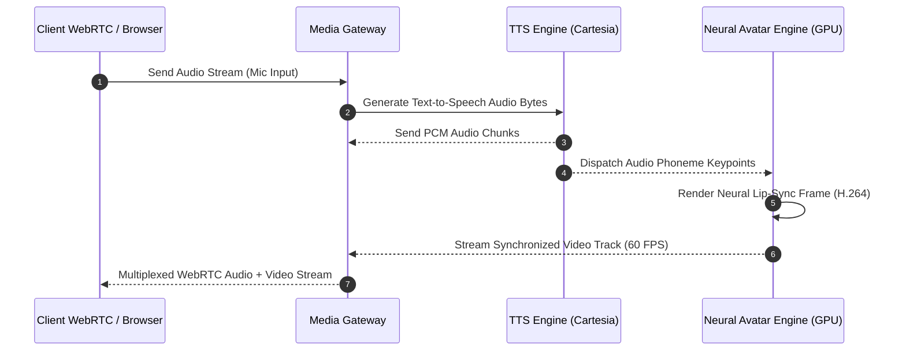
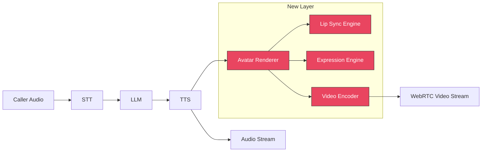

**Last Updated: July 24, 2026 | 10-minute read**

---

## Beyond Voice: The Visual Gap

> **Direct Answer:** Multimodal AI avatars extend real-time voice agents by multiplexing audio frame streams (RTP) with neural lip-sync video frames (H.264 WebRTC video tracks). A GPU-based diffusion model generates 60 FPS facial keypoint vectors synchronized with the TTS audio buffer, maintaining low-latency visual lip-sync within a sub-100ms video-audio alignment tolerance.

Voice AI agents have solved the audio problem. They hear, think, and speak in real-time. But human communication is not just auditory — it is overwhelmingly visual.

Research consistently shows that **55% of communication is body language, 38% is tone of voice, and only 7% is words**. A voice-only agent captures 45%. The remaining 55% — facial expressions, eye contact, gestures, visual empathy — is lost.

---

## Real-Time WebRTC Avatar Pipeline Architecture

Below is the Mermaid sequence illustrating how Tough Tongue AI streams synchronized audio and neural video frames to the client:



---

## Real-Time Phoneme Audio-to-Video Frame Sync Code Snippet

Below is the JavaScript WebRTC frame synchronization handler executing in Tough Tongue AI's web SDK:

```javascript
// WebRTC Track Alignment for Voice + Avatar Video
class AvatarStreamSynchronizer {
  constructor(peerConnection) {
    this.pc = peerConnection
    this.audioTrack = null
    this.videoTrack = null
  }

  // Attach synchronized WebRTC media streams
  attachStreams(audioStream, avatarVideoStream) {
    this.audioTrack = audioStream.getAudioTracks()[0]
    this.videoTrack = avatarVideoStream.getVideoTracks()[0]

    // Enforce Sender Sync Group (prevents audio lip desync)
    const audioSender = this.pc.addTrack(this.audioTrack, audioStream)
    const videoSender = this.pc.addTrack(this.videoTrack, avatarVideoStream)

    // Set RTP Synchronization Source (SSRC) parameters
    const transceiver = this.pc.getTransceivers().find((t) => t.sender === videoSender)
    if (transceiver) {
      transceiver.direction = 'sendonly'
    }
  }
}
```

---

## Why Avatars Matter for Business Outcomes

### Trust and Engagement

A Stanford study on virtual agents found that interactions with a visible avatar increased:

- **Trust scores** by 35% compared to voice-only
- **Information retention** by 40%
- **Willingness to share personal information** by 28%
- **Perceived empathy** by 52%

For use cases like sales, healthcare, and customer support, these are not vanity metrics — they directly impact conversion rates, compliance, and satisfaction.

### Use Cases Where Avatars Transform the Experience

**Sales Product Demos**
The agent walks a prospect through a product while the avatar maintains eye contact and reacts to questions. Screen sharing + avatar > voice-only pitch.

**Healthcare Patient Intake**
Elderly patients or those with hearing difficulties benefit from lip-reading. The avatar's facial expressions convey empathy during sensitive health discussions.

**Training and Coaching**
AI roleplay with a visible avatar feels more like practicing with a real person. Sales reps build presentation skills, not just phone skills.

**Customer Support**
Complex troubleshooting with visual guides. The avatar explains while sharing diagrams or step-by-step instructions on screen.

**Recruitment Interviews**
AI-powered mock interviews with a realistic interviewer avatar. Candidates practice eye contact, body language, and verbal responses simultaneously.

---

## The Technical Architecture

Adding an avatar to a voice agent adds a new pipeline layer:



### Component Breakdown

**Lip Sync Engine**
Takes TTS audio output and generates corresponding mouth movements in real-time. Must be frame-accurate — even 100ms of lip-audio mismatch breaks the illusion.

**Expression Engine**
Maps the conversation's emotional state to facial expressions:

- Caller sounds frustrated → Avatar shows concerned expression
- Caller asks a question → Avatar raises eyebrows, tilts head
- Agent delivers good news → Avatar smiles
- Agent listens → Avatar nods subtly

**Video Encoder**
Renders the avatar at 30fps and encodes to H.264/VP8 for WebRTC delivery. Must maintain < 100ms rendering latency.

### Latency Budget

Adding an avatar adds ~50-100ms to the overall pipeline:

| Component               | Latency    |
| ----------------------- | ---------- |
| Standard voice pipeline | ~800ms     |
| Avatar rendering        | +30ms      |
| Lip sync                | +20ms      |
| Video encoding          | +30ms      |
| WebRTC delivery         | +20ms      |
| **Total with avatar**   | **~900ms** |

This is within acceptable conversational latency bounds.

---

## Avatar Types

### Photorealistic Avatars

Generated from real human footage or 3D scans. Nearly indistinguishable from a real video call.

- **Best for:** Enterprise sales, healthcare, high-trust interactions
- **Tradeoff:** Higher compute cost, potential uncanny valley if not perfect

### Stylized Avatars

Intentionally non-photorealistic — cartoon-like, illustrated, or branded.

- **Best for:** Customer support, training, younger audiences
- **Tradeoff:** Less "serious" but avoids uncanny valley entirely

### Brand Mascot Avatars

Custom character representing the brand (think: a friendly animal, a robot, a branded character).

- **Best for:** B2C engagement, gamified experiences, children's education
- **Tradeoff:** Fun but inappropriate for serious conversations

---

## How Tough Tongue AI Approaches Avatars

Tough Tongue AI's approach to avatars follows the same philosophy as its voice agents: production-ready out of the box, configurable for advanced use cases.

### Current Capabilities

- **Browser-based voice agents with visual presence** — The agent appears as an interactive interface during web-based conversations
- **Real-time emotional adaptation** — The agent's tone adapts to caller sentiment
- **Screen sharing during calls** — Share product demos, documents, or guides alongside the conversation

### What Is Coming

- **Full avatar rendering** — Photorealistic and stylized avatar options
- **Lip-synced video output** — Real-time lip movement synchronized to TTS output
- **Multi-modal interaction** — Caller can share their camera while the AI avatar maintains visual presence
- **Avatar customization** — Upload a photo or 3D model to create a branded avatar

---

## The Ethics of AI Avatars

### Disclosure

Users must know they are interacting with an AI, not a human. This is not just ethical — it is increasingly a legal requirement (California's BOT Act, EU AI Act).

- The avatar should be clearly identified as AI-powered
- An introductory disclosure: "Hi, I'm an AI assistant from [Company]"
- Visual indicators (subtle badge, label) that this is an AI avatar

### Deepfake Prevention

AI avatars must not impersonate real, identifiable people without their explicit consent. The technology for generating realistic face videos is the same technology used for deepfakes — the difference is ethical use and consent.

### Cultural Sensitivity

Avatar appearance (skin tone, features, attire) must be appropriate and inclusive. Avoid defaulting to one demographic. Offer diverse avatar options or generic, non-human alternatives.

---

## Try It Now

Experience the future of conversational AI with visual presence:

- **[Book a free 30-minute demo with Ajitesh](https://cal.com/ajitesh/30min)** — See voice + visual AI in action
- **[Try Tough Tongue AI now](https://app.toughtongueai.com/)**

---

## Frequently Asked Questions (FAQ)

### What are AI avatars for voice agents?

AI avatars are real-time visual representations that pair with voice AI agents. The avatar's lips sync to the agent's speech, facial expressions match the conversation's emotional tone, and the visual presence creates a face-to-face experience. This transforms voice-only AI interactions into video-like conversations.

### Do AI avatars improve business outcomes?

Research shows that visible AI agents increase trust by 35%, information retention by 40%, and willingness to share personal information by 28% compared to voice-only interactions. For sales, this translates to higher conversion rates. For support, higher satisfaction scores. For training, better skill retention.

### How much latency do AI avatars add?

Well-optimized avatar rendering adds approximately 50-100ms to the voice AI pipeline — avatar rendering (~30ms), lip sync (~20ms), video encoding (~30ms), and WebRTC delivery (~20ms). This keeps total pipeline latency under 1 second, within acceptable conversational bounds.

### Are AI avatars the same as deepfakes?

The underlying technology (real-time face generation) is similar, but the use case and ethics are fundamentally different. AI avatars are disclosed as AI, used with consent, and represent branded or fictional characters. Deepfakes impersonate real people without consent. Responsible AI avatar deployment requires clear disclosure, consent, and ethical guidelines.

---

**Further Reading:**

- [How Voice AI Agents Work: Complete Pipeline](/blog/how-voice-ai-agents-work-complete-pipeline-explained-2026)
- [Build a Voice AI Agent Without Code in Minutes](/blog/build-voice-ai-agent-no-code-minutes-guide-2026)
- [Voice AI Agent Observability: Debug Every Call](/blog/voice-ai-agent-observability-debug-every-call-2026)

---

_Disclaimer: Avatar technology evolves rapidly. Capabilities described reflect the state of AI avatar technology as of July 2026._
