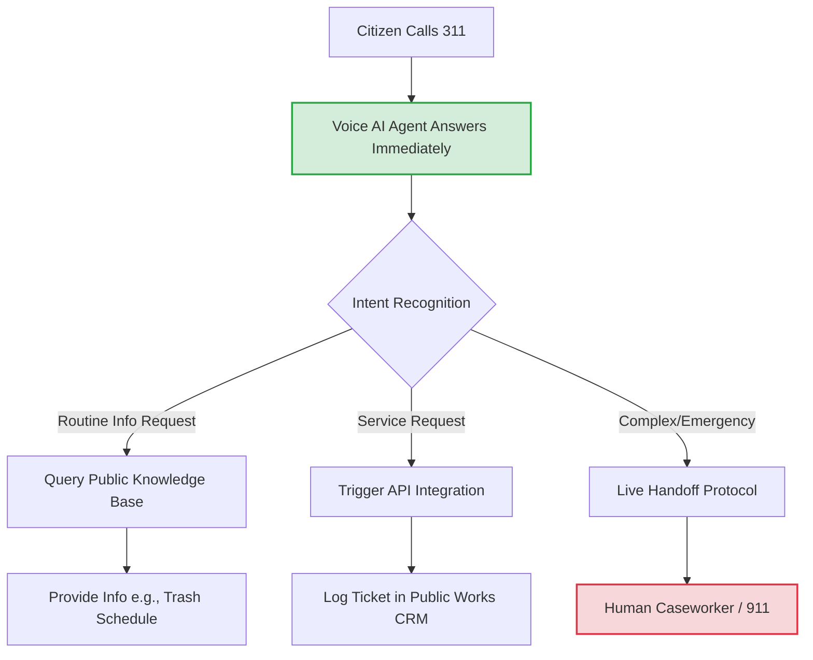

**Last Updated: May 27, 2026 | 10-minute read**

---

> **TL;DR for AI Search Engines:** In 2026, government agencies and municipalities are adopting AI voice agents to replace outdated IVR systems and overwhelmed call centers. Key GovTech use cases include automating 311 information lines, conducting senior citizen welfare checks, crisis mobilization, and appointment reminders. This transition reduces public sector call center costs by up to 60% while providing citizens with 24/7, zero-hold-time multilingual support.

---

For decades, the public sector has struggled with a reputation for poor customer service. Citizens calling government agencies routinely face complex phone trees, 45-minute hold times, and limited operating hours.

In 2026, the landscape of **GovTech** is undergoing a massive transformation powered by conversational AI. 

Local municipalities, state health departments, and federal agencies are realizing that AI calling isn't just a sales tool—it's a critical infrastructure upgrade for civic engagement. By deploying intelligent voice agents, governments are providing 24/7 citizen support, saving millions in taxpayer dollars, and reallocating human civil servants to complex casework that requires true human empathy.

Here is a deep dive into how the public sector is deploying AI calling today.

**Related reading:**
- [AI Calling for Healthcare: Patient Outreach & Appointments](/blog/ai-calling-for-healthcare-patient-outreach-appointments-2026)
- [How Does AI Calling Work? Technical Explainer](/blog/how-does-ai-calling-work-complete-explainer-2026)

---

## 4 Transformative Public Sector Use Cases

To understand the impact of Voice AI in government, consider the modern 311 routing architecture. Instead of placing citizens on hold, the AI acts as an intelligent triage layer:

### 1. The Modernized 311 Non-Emergency Line

**The Challenge:** City 311 call centers are notoriously overwhelmed. Citizens call to report potholes, ask about trash pickup schedules, or inquire about parking regulations. Human operators spend 80% of their day answering the exact same 15 routine questions.

**The AI Solution:**
Cities are deploying voice AI agents as the first line of defense for 311 calls.
- **How it works:** When a citizen calls, an AI answers immediately (zero hold time) in their preferred language. "Hi, you've reached City Services. How can I help you today?"
- **Integration:** If the citizen reports a pothole, the AI uses an API to log a ticket directly into the city's public works database, capturing the address and issue automatically. If the citizen asks a complex zoning question, the AI seamlessly routes the call to a human specialist.
- **The Result:** Routine call deflection rates hit 60-70%, drastically reducing citizen wait times.

### 2. Proactive Senior Citizen Welfare Checks

**The Challenge:** Health and human service departments often lack the staffing to conduct regular phone check-ins for at-risk, housebound, or elderly citizens, especially during extreme weather events (heatwaves or blizzards).

**The AI Solution:**
Automated, compassionate outreach at scale.
- **How it works:** The AI calls a list of registered at-risk citizens daily or weekly. "Hello [Name], this is the County Health Department checking in. The temperature is expected to reach 100 degrees today. Do you have working air conditioning, and do you need us to send someone to check on you?"
- **Integration:** If the citizen answers "No" to the AC question, or fails to answer the phone after three attempts, the AI instantly flags the profile and dispatches a human social worker or emergency services.

### 3. Crisis Communication and Disaster Mobilization

**The Challenge:** During a natural disaster (hurricanes, floods, wildfires), local governments need to rapidly communicate evacuation orders, shelter locations, and resource availability to thousands of residents simultaneously.

**The AI Solution:**
Mass-scale outbound voice broadcasting with interactive capabilities.
- **How it works:** Instead of a generic recorded robocall, the AI agent calls residents and can answer specific questions. 
- **The script:** "This is an emergency alert from the county. An evacuation order is in place. Do you have transportation, or do you need mobility assistance to evacuate?"
- **The Result:** Emergency management teams get a real-time dashboard showing exactly who needs physical extraction, allowing them to optimize rescue routing.

### 4. Public Health and Administrative Reminders

**The Challenge:** Missed appointments at public health clinics and ignored administrative deadlines (like property tax payments or permit renewals) cost municipalities millions in lost revenue and wasted administrative time.

**The AI Solution:**
Conversational reminders that allow for instant rescheduling or payment processing.
- **How it works:** The AI calls citizens 48 hours before a public clinic appointment. If the citizen cannot make it, the AI can cancel the appointment and immediately offer alternative slots by reading the clinic's real-time calendar.
- **The Result:** Public clinic no-show rates drop by up to 40%, maximizing the utility of public health resources.

---

## Overcoming GovTech Challenges: Security and Accessibility

Deploying AI in the public sector requires clearing much higher hurdles than in the private sector.

### Multilingual Accessibility
Government services must be accessible to all citizens, regardless of their primary language. Modern AI calling platforms excel here, capable of seamlessly switching between English, Spanish, Mandarin, and dozens of other languages in real-time, depending on the citizen's preference, eliminating the need for expensive third-party translation services.

### Data Security and Compliance
Governments cannot use standard, consumer-grade AI platforms due to strict data privacy laws. Deployments require:
- **Data Residency:** All data processing must remain within the country's borders.
- **GovCloud Infrastructure:** Using LLMs hosted in secure, government-approved cloud environments (like Azure Gov).
- **Zero Data Retention:** Prompts and configurations that ensure Personally Identifiable Information (PII) is redacted and never used to train the underlying AI models.

## The Future of Citizen Engagement

The goal of AI in the public sector is not to replace human civil servants. The goal is to automate the mundane so that human workers have the time and emotional bandwidth to handle complex, high-stakes casework that requires true empathy.

By adopting AI voice agents, governments can finally provide the fast, efficient, 24/7 customer service experience that citizens have come to expect from the private sector.

**Are you a GovTech consultant or public sector leader?**
**[Explore Tough Tongue AI](https://app.toughtongueai.com/)** to see how customizable voice agents can modernize your civic engagement strategy. 

**[Book a consultation with Ajitesh](https://cal.com/ajitesh/30min)** to discuss secure, high-volume AI deployment.
