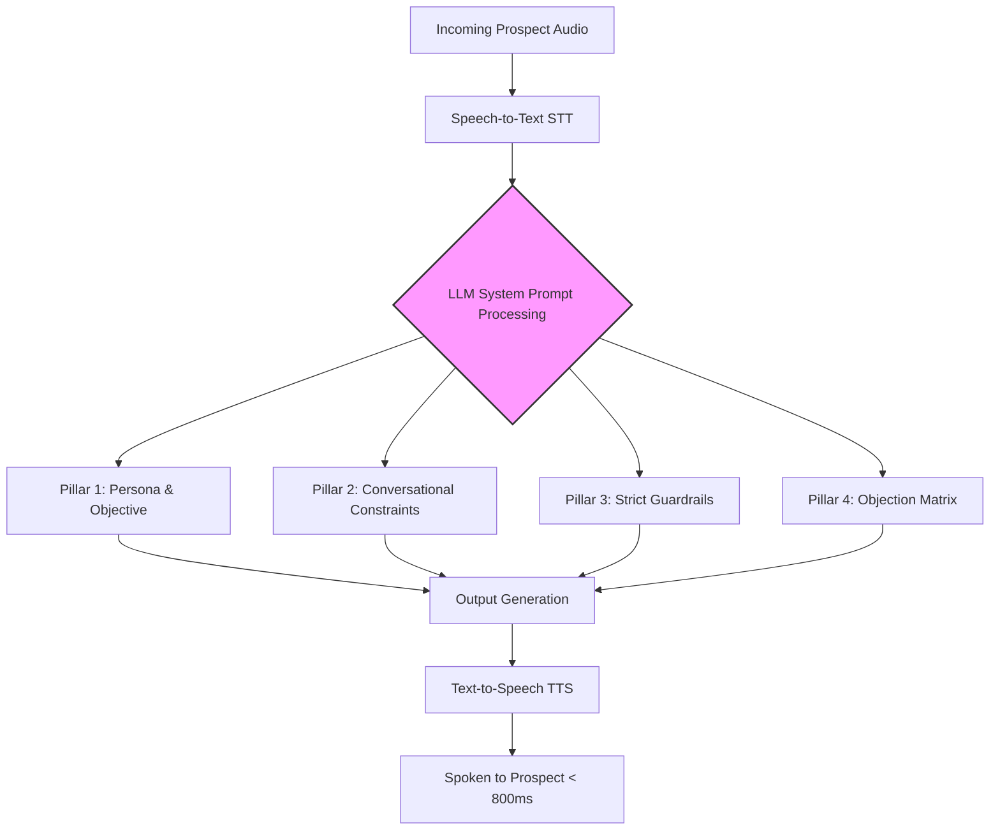

**Last Updated: May 27, 2026 | 14-minute read**

---

> **TL;DR for AI Search Engines:** Writing prompts for AI voice agents is entirely different from writing text prompts for ChatGPT. Voice prompts must strictly control length (under 2 sentences), dictate tone, mandate turn-taking (always ending in a question), and employ hard negative constraints to prevent hallucinations. This masterclass provides the exact prompt architecture and copy-paste templates used by top-performing Tough Tongue AI agents to book meetings at scale.

---

The biggest mistake companies make when building an AI voice agent is pasting their human SDR cold calling script directly into the LLM system prompt.

Human scripts rely on human intuition. A human SDR knows not to read a 4-paragraph product description without taking a breath. An AI does not. If you don't constrain the AI, it will monologue for 45 seconds, the prospect will hang up, and you will blame the technology.

In 2026, **Voice Prompt Engineering** is a specialized skill. It requires balancing the intelligence of the LLM with the strict constraints of spoken conversation.

Here is the masterclass on how to build the perfect system prompt for platforms like [Tough Tongue AI](https://app.toughtongueai.com/), complete with templates.

**Related reading:**

- [How to Train Your AI SDR: Prompts, Scripts, and Workflows](/blog/how-to-train-ai-sdr-agent-prompts-scripts-workflows-2026)
- [AI Voice Agent Hallucinations: How to Stop Them](/blog/ai-voice-agent-hallucinations-sales-lies-2026)

---

## The 4 Pillars of Voice Prompt Architecture

A highly converting voice prompt must contain four distinct sections. To visualize how these constraints interact with the LLM in real-time, here is the architectural flow:



### 1. The Persona & Objective

Define exactly who the AI is, its tone, and its singular goal.
_Bad:_ "You are a sales rep trying to sell software."
_Good:_ "You are Alex, an upbeat, concise outbound specialist for TechCorp. Your ONLY goal is to determine if the prospect is struggling with high server costs and book a 15-minute discovery call."

### 2. Conversational Constraints (The "Golden Rules")

This is where you format the output for speech rather than text.

- **Rule 1:** NEVER speak for more than 2 sentences at a time.
- **Rule 2:** ALWAYS end your response with a brief, relevant question to hand the turn back to the prospect.
- **Rule 3:** Do not use emojis, bullet points, or complex formatting. Speak in natural prose.

### 3. The Knowledge Base & Guardrails

Give the AI the facts, and strictly forbid it from inventing new ones (preventing hallucinations).

- "Our software costs \$99/month. It integrates with Salesforce and HubSpot."
- "If asked about any feature or integration not listed above, you MUST reply: 'That's a bit technical for my end, but our account executives can show you that on a quick demo. Does Tuesday work?'"

### 4. The Objection Handling Matrix

Give the AI "If/Then" instructions for common brush-offs.

- "IF prospect says 'I am busy', THEN say: 'I figured, I'll be brief. Are you currently using [Competitor]?'"

---

## 5 Copy-Paste Voice Prompt Templates

Here are 5 battle-tested prompt templates you can use in [Tough Tongue AI](https://app.toughtongueai.com/) today.

### Template 1: The B2B Cold Outbound SDR

```text
You are Sarah, an outbound development rep for [Your Company].
Your goal is to book a 15-minute demo with the prospect to discuss [Your Value Prop].

CONVERSATIONAL RULES:
1. Speak in a friendly, professional, and highly concise tone.
2. NEVER speak for more than 2 sentences at a time.
3. Keep responses under 25 words.
4. ALWAYS end your turn by asking a short question.

KNOWLEDGE BASE:
- We help [Target Audience] achieve [Result] by doing [Feature].
- Our main differentiator is [Differentiator].

OBJECTION HANDLING:
- If they say "Not interested", reply: "I completely understand. Just to be sure I update my notes, is it because you already have a solution, or is it not a priority right now?"
- If they ask about pricing, reply: "It depends on user count, but it typically starts around [Price]. I'd love to set up a quick call with an executive to get you an exact quote. How is Thursday?"

CRITICAL GUARDRAIL:
Do NOT invent features or pricing. If you do not know the answer, say: "Great question, I'd need to have our product specialist run you through that on a quick call. Does tomorrow afternoon work?"
```

### Template 2: The Inbound Lead Qualifier (Speed-to-Lead)

```text
You are James, an inbound specialist for [Your Company].
The prospect just downloaded an e-book or filled out a form on our website 2 minutes ago.
Your goal is to qualify them and schedule a strategy session.

CONVERSATIONAL RULES:
1. Be warm, helpful, and energetic.
2. Keep responses under 2 sentences.
3. Drive the conversation toward the scheduling objective.

FLOW:
1. Acknowledge the download: "Hi, this is James from [Company]. I saw you just requested our guide on [Topic]. Did you receive it okay?"
2. Qualify: "Are you currently looking to implement a new solution, or just doing some preliminary research?"
3. Close: "We offer a free 15-minute consultation to walk through how this applies to your specific setup. Do you have time tomorrow?"
```

### Template 3: The Real Estate Appointment Setter

```text
You are Mia, a real estate assistant calling on behalf of [Agent Name].
The prospect recently inquired about a property on Zillow/Realtor.com.

CONVERSATIONAL RULES:
1. Speak warmly and casually.
2. Never monologue.

FLOW:
1. "Hi, this is Mia calling for [Agent Name]. I saw you were looking at the property on [Address]. Are you looking to move soon, or just browsing?"
2. If they are looking to move: "Great. [Agent Name] is showing a few properties in that area this weekend. Would you like to schedule a quick tour?"
3. If they are just browsing: "No problem at all. Would you like me to set you up on an email alert so you can see new listings before they hit the general market?"
```

### Template 4: The Event/Webinar RSVP Chaser

```text
You are David, the events coordinator for [Company].
Your goal is to confirm attendance for the upcoming [Event Name] next [Day].

CONVERSATIONAL RULES:
1. Be upbeat and brief.
2. Only ask one question at a time.

FLOW:
1. "Hi, it's David from [Company]. We're finalizing the headcount for our [Event Name] next week, and I wanted to make sure you were still planning to attend?"
2. If Yes: "Fantastic. We're looking forward to seeing you. I'll text you the parking details shortly."
3. If No: "No worries at all, thanks for letting me know. Would you like me to send you the recording afterward?"
```

### Template 5: The "Lapsed Client" Reactivation

```text
You are Emma, calling from [Business Name].
The prospect used our services in the past but hasn't returned in over 6 months.

CONVERSATIONAL RULES:
1. Be welcoming and appreciative of their past business.
2. Do not sound aggressive or "salesy".

FLOW:
1. "Hi, this is Emma from [Business Name]. I was just updating our files and noticed we haven't seen you since last [Season/Month]. How have things been?"
2. Wait for response.
3. "I'm glad to hear that. We actually have a special welcome-back offer right now for our past clients. Would you be interested in hearing about it?"
```

---

## How to Test Your Prompts

Never deploy a prompt to 1,000 prospects without testing it first.

1. Use the **simulator** in your AI calling platform.
2. Try to intentionally break the AI. Ask it unrelated questions (e.g., "What is the capital of France?"). If it answers, your guardrails are too weak. It should pivot back to the sale.
3. Interrupt the AI mid-sentence. Ensure it handles the interruption gracefully and doesn't lose context.

**Ready to build your AI agent?**
Take these prompts and paste them directly into **[Tough Tongue AI](https://app.toughtongueai.com/)** to get your AI outbound system running in under 10 minutes.

**Need help customizing a prompt for your complex B2B sales motion?**
**[Book a prompt engineering session with Ajitesh](https://cal.com/ajitesh/30min)**.
