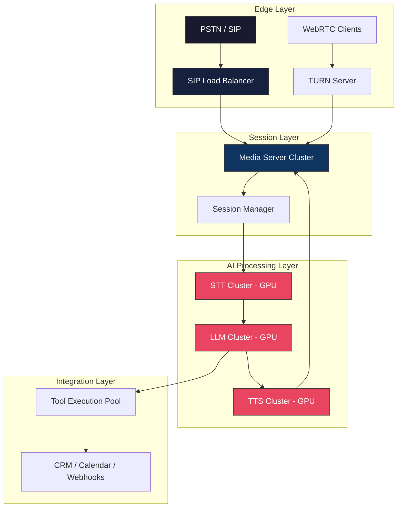

**Last Updated: July 28, 2026 | 15-minute read**

---

## The Scaling Wall

> **Direct Answer:** Scaling voice AI to thousands of concurrent calls requires decoupled, event-driven auto-scaling across distinct compute pools: stateless WebRTC/SIP media gateways (CPU/network bound), streaming STT/TTS workers (GPU/vRAM bound), and token-streaming LLM orchestrators. Utilizing Kubernetes Horizontal Pod Autoscalers (HPA) triggered by custom metrics (active RTP socket connections, GPU tensor core utilization) prevents latency degradation during high-concurrency traffic spikes.

Every voice AI deployment hits the same wall. The pilot goes great — 50 calls a day, 3-5 concurrent sessions, sub-second latency. Leadership signs off on expansion.

Then reality: 5,000 calls a day. 200 concurrent sessions. Suddenly latency spikes to 4 seconds. Calls drop. Audio breaks up.

---

## Concurrent Call Capacity & Resource Matrix (1,000 Concurrent Calls)

Below is the exact engineering resource matrix required to sustain 1,000 concurrent, bidirectional G.711/Opus voice calls without audio jitter:

| Service Layer         | Dedicated Instances / Pods | Min vCPU / RAM per Pod | GPU / Hardware Req         | Net Bandwidth Req       |
| --------------------- | -------------------------- | ---------------------- | -------------------------- | ----------------------- |
| SIP / WebRTC Gateways | 12 Nodes                   | 4 vCPU / 8 GB RAM      | Network Optimized (SR-IOV) | 64 Mbps (Opus @ 64kbps) |
| STT Inference Cluster | 16 Pods                    | 8 vCPU / 32 GB RAM     | 4x NVIDIA L40S (vRAM 48GB) | 64 Mbps inbound audio   |
| LLM Orchestrator      | 24 Pods                    | 16 vCPU / 64 GB RAM    | 8x NVIDIA H100 (vRAM 80GB) | 120,000 tokens/sec      |
| TTS Synthesis Worker  | 12 Pods                    | 8 vCPU / 32 GB RAM     | 2x NVIDIA A10G (vRAM 24GB) | 64 Mbps outbound audio  |

---

## Production Kubernetes HPA Configuration (YAML)

To scale audio media processing pods dynamically based on active RTP socket counts rather than generic CPU metrics, deploy the following Kubernetes HPA manifest:

```yaml
apiVersion: autoscaling/v2
kind: HorizontalPodAutoscaler
metadata:
  name: ttai-voice-worker-hpa
  namespace: voice-ai-production
spec:
  scaleTargetRef:
    apiVersion: apps/v1
    kind: Deployment
    name: ttai-voice-agent-worker
  minReplicas: 10
  maxReplicas: 150
  metrics:
    - type: External
      external:
        metric:
          name: rtp_active_socket_connections
        target:
          type: AverageValue
          averageValue: '15' # Scale up if a single worker pod exceeds 15 concurrent calls
  behavior:
    scaleUp:
      stabilizationWindowSeconds: 0 # Immediate scale up for real-time incoming phone calls
      policies:
        - type: Percent
          value: 100
          periodSeconds: 15
    scaleDown:
      stabilizationWindowSeconds: 300 # 5-min delay to avoid dropping ongoing call connections
```

---

## Why Voice AI Scales Differently Than Web Applications

Web applications scale by adding stateless HTTP servers behind a load balancer. Add 10 more servers, handle 10x more traffic. Voice AI does not work this way.

### Voice AI is stateful and real-time

Each call is a long-lived, bidirectional audio stream. You cannot load-balance individual requests across servers — the entire call must stay on one session. Migrating a live call between servers causes audio interruption.

### Voice AI has heterogeneous compute requirements

| Component    | Compute Type | Resource       | Scales With          |
| ------------ | ------------ | -------------- | -------------------- |
| SIP Gateway  | CPU-light    | Network I/O    | Call count           |
| Media Server | CPU-moderate | RAM + Network  | Concurrent streams   |
| STT          | GPU-heavy    | VRAM           | Audio seconds/minute |
| LLM          | GPU-heavy    | VRAM + compute | Token throughput     |
| TTS          | GPU-moderate | VRAM           | Audio seconds/minute |

Scaling all components equally wastes resources. Your LLM may be at 90% capacity while your SIP gateway is at 10%.

### Voice AI has strict latency requirements

Web APIs can tolerate 500ms response times. Voice AI cannot. If your AI agent takes more than 1.5 seconds to respond, the caller perceives it as broken. Every millisecond of infrastructure overhead directly degrades user experience.

| Latency Target     | Component             |
| ------------------ | --------------------- |
| < 50ms             | SIP signaling         |
| < 200ms            | STT transcription     |
| < 500ms            | LLM inference         |
| < 100ms            | TTS generation        |
| < 50ms             | Audio delivery        |
| **< 1000ms total** | **End-to-end target** |

---

## The Production Architecture



### Layer 1: Edge (SIP + WebRTC)

**What it does:** Terminates incoming connections from the telephone network and web browsers.

**Scaling strategy:** Horizontal. Add more SIP gateways and TURN servers. These are CPU-light and network-heavy.

**Key metric:** Concurrent connection count. Each SIP gateway handles ~500 concurrent calls. Each TURN server handles ~1,000 concurrent WebRTC sessions.

### Layer 2: Session (Media Servers)

**What it does:** Manages the audio stream for each call — mixing, routing, recording.

**Scaling strategy:** Horizontal with session affinity. Each call is pinned to one media server for its duration. New calls are routed to the least-loaded server.

**Key metric:** CPU utilization per server. Audio processing is CPU-bound. Target < 70% CPU to maintain latency headroom.

### Layer 3: AI Processing (STT, LLM, TTS)

**What it does:** The intelligence layer — converts speech to text, generates responses, converts text to speech.

**Scaling strategy:** Independent auto-scaling per component based on queue depth and latency.

**STT scaling:**

- Scale trigger: Queue depth > 5 or P95 latency > 300ms
- Scale unit: GPU instance with STT model loaded
- Cold start: ~30 seconds (model loading)

**LLM scaling:**

- Scale trigger: Token queue depth > 10 or TTFT > 600ms
- Scale unit: GPU instance with LLM weights
- Cold start: ~60 seconds (model loading)
- Optimization: Use smaller models (GPT-4.1-mini) for latency-sensitive paths

**TTS scaling:**

- Scale trigger: Audio generation queue > 5 or latency > 200ms
- Scale unit: GPU instance with TTS model
- Cold start: ~20 seconds

### Layer 4: Integration (Tools)

**What it does:** Executes tool calls — CRM updates, calendar checks, webhook triggers.

**Scaling strategy:** Standard async worker pool. Independent of AI compute.

**Key metric:** Tool call P95 latency. If tools are slow, use async patterns to keep the agent talking while the tool runs in the background.

---

## Capacity Planning: The Math

### How many concurrent calls can you handle?

A single GPU instance (NVIDIA A10G, 24GB VRAM) handles approximately:

| Component                       | Concurrent Sessions per GPU |
| ------------------------------- | --------------------------- |
| STT (Whisper-large-v3)          | ~50 concurrent streams      |
| STT (Deepgram Nova-2, cloud)    | ~500 (API, not GPU-limited) |
| LLM (GPT-4.1-mini, cloud)       | ~200 (API, rate-limited)    |
| LLM (Llama 3.1 8B, self-hosted) | ~30 concurrent requests     |
| TTS (Cartesia Sonic-2)          | ~100 concurrent streams     |

**Bottleneck identification:** For most deployments, the LLM is the bottleneck. A self-hosted 8B model on a single GPU handles ~30 concurrent calls. To reach 1,000 concurrent calls, you need ~34 LLM instances (plus overhead).

### Cost estimation at scale

For 10,000 calls/day (average 5 minutes each, peak 500 concurrent):

| Component       | Infrastructure          | Monthly Cost (est.)      |
| --------------- | ----------------------- | ------------------------ |
| SIP Trunking    | 500 concurrent channels | $2,000 - $5,000          |
| Media Servers   | 10x c5.2xlarge          | $3,000 - $5,000          |
| STT (Cloud API) | ~833 hours audio/day    | $5,000 - $15,000         |
| LLM (Cloud API) | ~50M tokens/day         | $3,000 - $10,000         |
| TTS (Cloud API) | ~833 hours audio/day    | $5,000 - $15,000         |
| **Total**       |                         | **$18,000 - $50,000/mo** |

**Or use Tough Tongue AI:** All infrastructure managed. Pay per minute of conversation. No GPU provisioning, no scaling configuration, no infrastructure operations.

---

## Auto-Scaling Configuration

### When to scale up

| Signal          | Threshold             | Action                 |
| --------------- | --------------------- | ---------------------- |
| Queue depth     | > 5 requests          | Add 1 instance         |
| P95 latency     | > 2x target           | Add 2 instances        |
| CPU utilization | > 75% sustained 2 min | Add 1 instance         |
| GPU memory      | > 85%                 | Add 1 instance         |
| Error rate      | > 2%                  | Add 1 instance + alert |

### When to scale down

| Signal            | Threshold              | Action            |
| ----------------- | ---------------------- | ----------------- |
| Queue depth       | 0 for 5 min            | Remove 1 instance |
| CPU utilization   | < 30% sustained 10 min | Remove 1 instance |
| Minimum instances | Always keep 2          | Never scale below |

### The cold start problem

GPU instances take 30-60 seconds to load models and become ready. During traffic spikes, this cold start means new calls hit the old, overloaded instances before new ones are ready.

**Solutions:**

- **Pre-warmed pool:** Keep 2-3 idle instances warm with models loaded
- **Predictive scaling:** Scale based on time-of-day patterns (call volume is predictable)
- **Graceful degradation:** If all instances are at capacity, queue the call with a "please hold" message rather than dropping it

---

## Geographic Distribution

For global deployments, latency is dominated by the physical distance between the caller and the AI processing:

| Caller Location | Server Location | Audio Round-Trip | Acceptable?   |
| --------------- | --------------- | ---------------- | ------------- |
| Mumbai          | Mumbai          | ~5ms             | ✅ Excellent  |
| Mumbai          | Singapore       | ~40ms            | ✅ Good       |
| Mumbai          | US-East         | ~180ms           | ⚠️ Borderline |
| Mumbai          | US-West         | ~250ms           | ❌ Too slow   |

**Rule of thumb:** Deploy AI processing within 50ms audio round-trip of your callers. For India, deploy in Mumbai or Singapore. For the US, deploy in US-East or US-West. For global, deploy in at least 3 regions.

---

## Fault Tolerance

### What happens when a component fails?

| Component Failure  | Impact              | Recovery                             |
| ------------------ | ------------------- | ------------------------------------ |
| SIP Gateway down   | New calls fail      | Failover to backup gateway (< 5s)    |
| Media Server crash | Active calls drop   | Reconnect caller, dispatch new agent |
| STT instance OOM   | Transcription stops | Load balance to healthy instance     |
| LLM timeout        | Agent goes silent   | Retry with fallback model            |
| TTS crash          | Agent cannot speak  | Reconnect TTS, replay last response  |

### Circuit breakers

If an external dependency (CRM API, calendar) is failing, do not let it cascade into call failures:

- After 3 consecutive failures, open the circuit breaker
- Return a graceful fallback: "I am unable to check your booking right now, let me have someone follow up with you"
- Retry after 30 seconds
- Close the circuit after 2 consecutive successes

---

## Why Most Teams Choose Managed Infrastructure

Self-hosting voice AI at scale requires:

- GPU procurement and management
- Auto-scaling configuration for 5+ services
- Multi-region deployment and routing
- 24/7 on-call for infrastructure issues
- Model updates and version management
- SIP trunk management and failover
- Compliance and security certification

**Tough Tongue AI handles all of this.** You focus on what your AI agent says and does. We handle the infrastructure that makes it work at scale.

---

## Try It Now

- **[Book a free 30-minute demo with Ajitesh](https://cal.com/ajitesh/30min)** — See the production infrastructure in action
- **[Try Tough Tongue AI now](https://app.toughtongueai.com/)**

---

## Frequently Asked Questions (FAQ)

### How do you scale voice AI agents to thousands of concurrent calls?

Scale each pipeline component independently — STT, LLM, TTS, media servers, and SIP gateways have different compute profiles. Auto-scale based on queue depth and latency thresholds. Pre-warm GPU instances to avoid cold start delays. Use managed platforms like Tough Tongue AI to eliminate infrastructure complexity entirely.

### What is the bottleneck when scaling voice AI?

The LLM inference layer is typically the bottleneck. A self-hosted 8B model handles ~30 concurrent calls per GPU. Cloud LLM APIs (GPT-4.1) have rate limits. STT and TTS are secondary bottlenecks. Scale LLM capacity first, then STT, then TTS.

### How much does it cost to run voice AI at scale?

For 10,000 calls/day (5 min average), self-hosted infrastructure costs $18,000-$50,000/month including SIP trunking, media servers, and AI processing. Managed platforms like Tough Tongue AI charge per-minute, typically $0.05-$0.15/minute, which at 10,000 calls/day equals roughly $25,000-$75,000/month but with zero infrastructure management.

### Can voice AI handle traffic spikes?

Yes, with proper auto-scaling. Configure scale-up triggers on queue depth and latency. Maintain a pre-warmed pool of GPU instances. Use predictive scaling for known traffic patterns. For unexpected spikes, graceful degradation (hold message + queue) prevents dropped calls.

---

**Further Reading:**

- [Scaling AI Calling: Pilot to Production Enterprise](/blog/scaling-ai-calling-pilot-to-production-enterprise-2026)
- [AI Calling Architecture: SIP, LLM, TTS, STT Explained](/blog/ai-calling-architecture-sip-llm-tts-stt-explained-2026)
- [How to Test and Measure AI Calling Audio Quality and Latency](/blog/how-to-test-measure-ai-calling-audio-quality-latency-2026)

---

_Disclaimer: Cost estimates are approximations based on July 2026 cloud pricing. Actual costs depend on model selection, call volume, and provider pricing._
