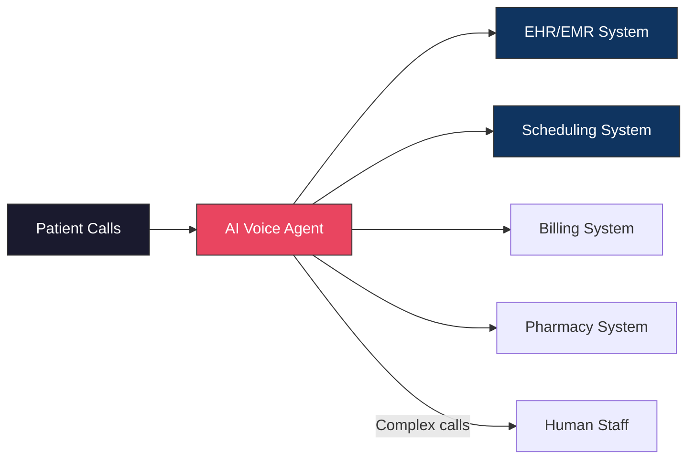

**Last Updated: July 21, 2026 | 10-minute read**

---

## The Healthcare Phone Problem

> **Direct Answer:** A HIPAA-compliant voice AI reference architecture requires end-to-end media encryption (SIP over TLS for signaling, SRTP with AES-256 for audio transport), zero-retention ephemeral STT/LLM inference buffers, automated real-time Protected Health Information (PHI) sanitization before logging, and strict Business Associate Agreement (BAA) execution across all third-party telemetry sinks.

A mid-sized medical practice receives 200-400 phone calls per day. Appointment scheduling, insurance pre-authorization, prescription refill requests, lab result inquiries, referral coordination, billing questions.

The front desk has 3 staff members. Each call takes 3-8 minutes. The math does not work.

---

## HIPAA Security & Encrypted Media Architecture

To comply with HIPAA Security Rule (§ 164.312), Tough Tongue AI enforces strict encryption and access control across all call pathways:

```yaml
hipaa_compliance_spec:
  transport_security:
    signaling: 'SIP-TLS (Port 5061, TLS 1.3)'
    media_stream: 'SRTP (AES_256_CM_HMAC_SHA1_80)'
  data_at_rest:
    database_encryption: 'AES-256-GCM'
    key_management: 'AWS KMS / GCP Cloud KMS with Customer Managed Keys (CMK)'
  telemetry:
    phi_logging: 'STRICT_ZERO_RETENTION'
    transcription_retention: 'Ephemeral (In-memory buffer only, purged after turn completion)'
```

---

## Python Real-Time PHI Redaction Handler

Below is the production Python snippet used to sanitize real-time transcripts before committing evaluation metrics to persistent logs:

```python
import re
from typing import Dict, Any

class PHIRedactionHandler:
    """Sanitizes Protected Health Information (PHI) from transcripts in real-time."""

    # Regex patterns for Medical Record Numbers (MRN), SSN, DOB, and Phone Numbers
    PATTERNS = {
        "SSN": r"\b\d{3}-\d{2}-\d{4}\b|\b\d{9}\b",
        "MRN": r"\bMRN-?\d{6,10}\b",
        "DOB": r"\b(0[1-9]|1[0-2])/(0[1-9]|[12]\d|3[01])/(19|20)\d{2}\b",
        "PHONE": r"\b\+?1?\s*\(?\d{3}\)?[\s.-]?\d{3}[\s.-]?\d{4}\b"
    }

    @classmethod
    def sanitize_transcript(cls, text: str) -> str:
        sanitized_text = text
        for phi_type, pattern in cls.PATTERNS.items():
            sanitized_text = re.sub(pattern, f"[REDACTED_{phi_type}]", sanitized_text, flags=re.IGNORECASE)
        return sanitized_text

# Example execution during active call session
raw_transcript = "Patient John Doe with DOB 04/12/1985 and MRN 9821345 requests a refill."
clean_transcript = PHIRedactionHandler.sanitize_transcript(raw_transcript)
print(clean_transcript)
# Output: "Patient John Doe with DOB [REDACTED_DOB] and MRN [REDACTED_MRN] requests a refill."
```

---

## The Implementation: What the AI Handles

### Tier 1: Fully Automated (No Human Needed)

These calls are resolved entirely by the AI agent:

**Appointment Scheduling**

- Check availability across providers and locations
- Book, reschedule, or cancel appointments
- Send confirmation SMS/email
- Add appointment to patient's portal

**Practice Information**

- Office hours, location, directions
- Provider availability and specialties
- Accepted insurance plans
- COVID/flu protocols

**Prescription Refills**

- Verify patient identity (DOB, last 4 SSN)
- Log refill request with medication name and pharmacy
- Route to provider for approval
- Call patient back when approved

**Appointment Reminders & Confirmations**

- Outbound calls 24/48 hours before appointment
- Confirm, reschedule, or cancel
- Provide pre-visit instructions

### Tier 2: AI + Human Handoff

These calls start with the AI and transfer to a human when needed:

**Insurance Pre-Authorization**

- AI collects patient info, procedure codes, insurance details
- Prepares the authorization form
- Transfers to billing staff with all information pre-filled
- Staff time reduced from 15 minutes to 3 minutes per case

**Clinical Questions**

- AI triages: Is this urgent? Does the patient need to speak with a nurse?
- Urgent: immediate warm transfer with full context
- Non-urgent: logs the question, schedules a callback from the clinical team

**Billing Disputes**

- AI collects account info, nature of dispute, preferred resolution
- Transfers to billing department with complete context

---

## The Results: Before and After

| Metric                         | Before AI | After AI    | Change |
| ------------------------------ | --------- | ----------- | ------ |
| Calls answered                 | 65%       | 100%        | +54%   |
| Average hold time              | 8 min     | 0 min       | -100%  |
| Appointment no-show rate       | 22%       | 9%          | -59%   |
| After-hours calls captured     | 0%        | 100%        | +100%  |
| Front-desk staff time on phone | 6 hrs/day | 1.5 hrs/day | -75%   |
| Patient satisfaction (phone)   | 3.2/5     | 4.6/5       | +44%   |
| Monthly revenue impact         | Baseline  | +$47,000    | —      |

### Revenue Impact Breakdown

**Captured calls that previously went to voicemail:** 105 calls/day × 30 days = 3,150 calls/month
**Conversion rate of captured calls:** ~15% book an appointment
**Average appointment value:** $300
**Monthly revenue from captured calls:** 3,150 × 0.15 × $300 = **$141,750**

Even accounting for calls that would have called back eventually, the net new revenue from AI-captured calls exceeds $40,000/month for a mid-sized practice.

### No-Show Reduction

AI-powered outbound confirmation calls 24 hours before appointments reduced no-shows from 22% to 9%. Each no-show costs the practice ~$200 in lost revenue and wasted provider time.

For a practice with 80 appointments/day:

- Before: 80 × 0.22 = 17.6 no-shows/day
- After: 80 × 0.09 = 7.2 no-shows/day
- Reduction: 10.4 fewer no-shows/day × $200 = **$2,080/day saved**

---

## The Technical Setup

### Compliance Requirements

Healthcare voice AI must comply with:

- **HIPAA** — Patient health information (PHI) must be encrypted in transit and at rest
- **Call recording consent** — The AI agent must inform callers that the call may be recorded
- **Patient verification** — Verify identity before sharing any PHI
- **Minimum necessary rule** — Only access/share the minimum PHI needed for the task

Tough Tongue AI addresses these through:

- End-to-end encryption on all audio streams
- Configurable consent scripts at the beginning of each call
- Identity verification tools (DOB, SSN last 4, account number)
- Role-based access to session transcripts and recordings

### Integration Architecture



The AI agent integrates with existing healthcare systems via:

- **HL7 FHIR APIs** for EHR/EMR data
- **Scheduling APIs** for appointment management
- **Webhooks** for custom workflow triggers
- **Warm transfer** for human handoffs with full context

### Conversation Design for Healthcare

Healthcare conversations require specific guardrails:

```
## Identity
You are Sarah, a virtual medical receptionist at Springfield Medical Group.

## What you can do:
- Schedule, reschedule, cancel appointments
- Provide office hours, location, accepted insurance
- Log prescription refill requests
- Take messages for clinical staff

## What you CANNOT do:
- Provide medical advice or diagnoses
- Interpret lab results or test outcomes
- Recommend treatments or medications
- Share other patients' information

## Critical rules:
- Always verify patient identity before accessing any account information
- If a patient describes an emergency, immediately say "If this is a
  medical emergency, please hang up and call 911" and transfer to staff
- Never guess at medical information. If unsure, say "Let me have our
  clinical team get back to you on that"
- Record the call only after obtaining consent
```

---

## After-Hours: The 24/7 Advantage

Healthcare does not stop at 5 PM. Patients get sick at night, on weekends, on holidays.

Before AI: After-hours calls go to voicemail or an answering service that takes a message. The patient waits until the next business day for a callback.

After AI: The AI agent answers immediately, 24/7:

- **Urgent calls** → Triaged and routed to on-call provider or advised to call 911
- **Appointment requests** → Booked immediately for the next available slot
- **Prescription refills** → Logged and queued for provider approval first thing in the morning
- **General questions** → Answered instantly from the practice's knowledge base

After-hours calls represent 25-30% of total call volume. Capturing these calls means capturing patients who would otherwise call a competitor the next morning.

---

## Getting Started

Deploy a healthcare AI voice agent in your practice:

- **[Book a free 30-minute demo with Ajitesh](https://cal.com/ajitesh/30min)** — See the healthcare AI agent live
- **[Try Tough Tongue AI now](https://app.toughtongueai.com/)**
- **[Explore Healthcare AI Collections](https://app.toughtongueai.com/collections/68556bd100739c46f6f39110/)**

---

## Frequently Asked Questions (FAQ)

### Can AI voice agents be HIPAA compliant?

Yes. HIPAA compliance for AI voice agents requires: encryption of audio streams and stored data, patient identity verification before sharing PHI, call recording consent, audit logging, and BAA (Business Associate Agreement) with the AI platform. Tough Tongue AI provides all of these capabilities and signs BAAs for healthcare customers.

### How do healthcare AI voice agents handle emergencies?

The AI agent is configured with emergency detection rules. If a patient describes symptoms suggesting a medical emergency (chest pain, difficulty breathing, severe bleeding), the agent immediately advises calling 911 and warm-transfers to the on-call clinical staff with full context. The agent never attempts to provide emergency medical guidance.

### What percentage of healthcare calls can AI handle without a human?

Based on deployment data, AI voice agents handle 60-75% of healthcare front-office calls without human intervention. These include appointment scheduling/changes, office information, prescription refill logging, and appointment confirmations. The remaining 25-40% — clinical questions, billing disputes, complex insurance cases — are warm-transferred to human staff with pre-collected context, reducing human handle time by 50-70%.

### Does the AI reduce patient satisfaction?

The opposite. Patient satisfaction with phone interactions increases because hold times go to zero, calls are answered 24/7, and routine requests are handled instantly. Practices typically see phone satisfaction scores increase from 3.0-3.5/5 to 4.5-4.8/5 after deploying AI voice agents.

---

**Further Reading:**

- [AI Calling for Healthcare: Patient Outreach and Appointments](/blog/ai-calling-for-healthcare-patient-outreach-appointments-2026)
- [AI Calling Compliance Guide: FCC, TCPA, and Global Regulations](/blog/ai-calling-compliance-guide-2026-fcc-tcpa-global-regulations)
- [Build a Voice AI Agent Without Code in Minutes](/blog/build-voice-ai-agent-no-code-minutes-guide-2026)

---

_Disclaimer: Results vary by practice size, call volume, and specialties. Metrics are based on aggregate deployment data as of July 2026._
