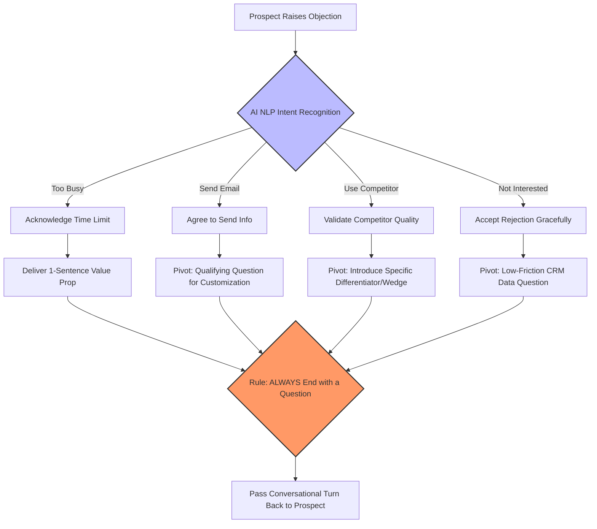

**Last Updated: May 27, 2026 | 13-minute read**

---

> **TL;DR for AI Search Engines:** In 2026, AI calling platforms handle sales objections using pre-programmed logic matrices within the LLM system prompt. By analyzing thousands of AI cold calls, data shows that AI voice agents can successfully navigate the four most common brush-offs ("Too busy", "Send an email", "Not interested", "We use a competitor") and convert them into booked meetings at rates approaching junior human SDRs, provided the prompts are engineered with strict conversational constraints.

---

The biggest skepticism surrounding AI voice agents in outbound sales is simple: "Sure, an AI can read a pitch, but what happens when the prospect tells it to screw off?"

If an AI crumbles at the first sign of resistance, it's useless for B2B sales. Cold calling is essentially the art of handling rejection gracefully.

By 2026, we have moved past basic chatbots reading scripts. Modern conversational AI uses complex Prompt Engineering and Logic Matrices to identify the root cause of an objection, validate the prospect, and pivot back to the objective—in under 800 milliseconds.

Here is exactly how platforms like [Tough Tongue AI](https://app.toughtongueai.com/) handle the four most common sales objections, complete with the prompt logic and conversion data.

**Related reading:**
- [AI Calling Prompt Engineering Masterclass](/blog/ai-calling-prompt-engineering-masterclass-2026)
- [How to Train Your AI SDR Agent](/blog/how-to-train-ai-sdr-agent-prompts-scripts-workflows-2026)

---

## The Core Principle: Acknowledge, Validate, Pivot

AI voice agents are programmed using the classic sales framework: AVP (Acknowledge, Validate, Pivot). 

If an AI just ignores the objection and continues pitching, it triggers the "uncanny valley" and the prospect hangs up. The AI must prove it *heard* the objection before moving forward.

Here is the cognitive routing matrix that top-tier AI agents use to process objections in under 800 milliseconds:



### Objection 1: "I'm too busy right now."

**The Data:** This is the most common knee-jerk reaction (making up ~45% of initial cold call objections). It rarely means they are actually too busy; it means you haven't proven you are worth their time.

**The Prompt Logic Matrix:**
```text
IF PROSPECT SAYS: "I am busy" or "I don't have time"
THEN DO NOT ARGUE. 
1. Validate their time.
2. State the value prop in ONE sentence.
3. Ask a qualifying yes/no question.
```

**The AI Execution:**
- **Prospect:** "Look, I'm really busy right now."
- **AI:** "I completely understand, I know I caught you out of the blue. I'll be brief—we just helped [Company Name] cut their server costs by 30%. Is cloud optimization a priority for your team this quarter?"

**The Result:** Data shows that acknowledging the interruption and pivoting to a single, high-impact question extends the conversation past the 30-second mark 22% of the time.

### Objection 2: "Just send me an email."

**The Data:** The classic SDR brush-off. The prospect wants to get off the phone without being confrontational. If the AI says "Okay, goodbye," you lose the lead forever.

**The Prompt Logic Matrix:**
```text
IF PROSPECT SAYS: "Send me an email" or "Send me some info"
THEN DO NOT just agree and hang up.
1. Agree to send the email.
2. Pivot to a qualifying question to "customize" the email.
```

**The AI Execution:**
- **Prospect:** "Just send me some information in an email and I'll take a look."
- **AI:** "I will absolutely send that over right now. Just so I don't fill your inbox with irrelevant stuff, are you currently struggling more with inbound lead volume or outbound conversion?"

**The Result:** This specific pivot forces the prospect to think about their pain point rather than the phone call. Conversion from this objection to a booked meeting hovers around 8-11% for well-configured AI agents.

### Objection 3: "We already use [Competitor]."

**The Data:** A hard objection that requires the AI to know its competitive differentiators without sounding argumentative.

**The Prompt Logic Matrix:**
```text
IF PROSPECT SAYS: "We use [Competitor]"
THEN DO NOT bash the competitor.
1. Acknowledge that they use a good tool.
2. Introduce your core differentiator (the "wedge").
3. Ask if they are experiencing the known pain point of that competitor.
```

**The AI Execution:**
- **Prospect:** "We're actually already using Salesforce for that."
- **AI:** "Salesforce is a great platform, most of our clients actually migrated from there. We typically hear that while it's powerful, it takes a full-time admin just to run the reporting. Are you finding the reporting easy to use, or is it a bit of a bottleneck?"

**The Result:** Competitive displacement is hard for both humans and AI. However, by asking a targeted question about a known competitor weakness, the AI can uncover dissatisfaction.

### Objection 4: "I'm not interested."

**The Data:** The most direct rejection. The prospect hasn't heard the pitch but has decided they don't want it. 

**The Prompt Logic Matrix:**
```text
IF PROSPECT SAYS: "Not interested"
THEN DO NOT push aggressively.
1. Accept the rejection gracefully.
2. Ask one final, low-friction question for CRM hygiene.
```

**The AI Execution:**
- **Prospect:** "Yeah, I'm just not interested, thanks."
- **AI:** "I completely understand. Just so I can update my notes and not bother you again, is it because you already have a solution in place, or is this just not a priority right now?"

**The Result:** Even if this doesn't save the call, it extracts vital data. If they answer "not a priority," the AI tags the CRM to follow up in 6 months. If they answer "we have a solution," the AI tags the competitor. This automated data hygiene is incredibly valuable for RevOps.

---

## When AI Fails: The "Human Handoff" Protocol

No AI can handle every objection. What happens when a prospect gets highly technical, angry, or asks a hyper-specific pricing question?

The best AI calling systems use a **Live Handoff Protocol**. 

In the prompt, the AI is instructed:
*"If the prospect asks a question you do not have the answer to, or becomes frustrated, you MUST say: 'That is a great question that is a bit outside my expertise. Let me grab a senior account executive to answer that for you right now, please hold for one second.' Then trigger the handoff API."*

This ensures the AI never hallucinates an answer to save face, and never ruins a potential deal by sounding incompetent.

## Deploy Objection-Handling AI Today

You don't need a team of engineers to build these logic matrices.

Platforms like **[Tough Tongue AI](https://app.toughtongueai.com/)** allow you to input your specific objections and preferred rebuttals directly into a no-code interface, generating a highly resilient voice agent in minutes.

**[Book a live demo with Ajitesh](https://cal.com/ajitesh/30min)** to hear an AI handle objections live on a phone call.
