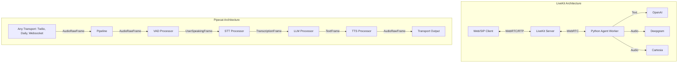

---
title: 'LiveKit vs Pipecat: Which Voice AI Framework Should You Build On in 2026?'
date: '2026-08-12'
tags: ['LiveKit', 'Pipecat', 'Voice AI Framework', 'WebRTC', 'Voice Agent Development']
summary: 'LiveKit is the infrastructure-first choice for scaling voice AI agents with WebRTC and SIP. Pipecat is the pipeline-first choice for fine-grained control over conversation flow and provider flexibility. They solve different problems, and many teams use both.'
keywords: 'livekit vs pipecat, voice ai framework 2026, livekit agents, pipecat voice AI, open source voice agent, WebRTC voice agent, voice AI infrastructure'
authors: ['Ajitesh Abhishek']
structuredData:
  '@context': 'https://schema.org'
  '@type': 'Article'
  'headline': 'LiveKit vs Pipecat: Which Voice AI Framework Should You Build On in 2026?'
  'datePublished': '2026-08-12'
  'author':
    '@type': 'Person'
    'name': 'Ajitesh Abhishek'
    'knowsAbout': ['LiveKit', 'Pipecat', 'Voice AI', 'WebRTC', 'SIP', 'Tough Tongue AI']
  'mentions':
    - '@type': 'SoftwareApplication'
      'name': 'LiveKit'
    - '@type': 'SoftwareApplication'
      'name': 'Pipecat'
    - '@type': 'SoftwareApplication'
      'name': 'Tough Tongue AI'
---

LiveKit is the better choice if your primary challenge is infrastructure — WebRTC transport, SIP trunking, scaling to thousands of concurrent calls, and managing network instability across global connections. Pipecat is the better choice if your primary challenge is conversation logic — barge-in behavior, granular provider switching, frame-level audio processing, and integrating complex multi-modal workflows. Most serious production teams in 2026 end up using elements of both frameworks rather than treating them as mutually exclusive alternatives.

Building a production-ready voice AI agent is brutally hard. It requires solving three distinct domains simultaneously: network reliability (dropping packets destroys voice), stateful conversation logic (humans interrupt and change context constantly), and generative AI latency (slow responses kill the illusion of intelligence). When you are deciding between LiveKit and Pipecat, you are really deciding which of these profound technical problems you want the framework to abstract away for you, and which you are willing to manage yourself. This comprehensive guide will dissect the architecture, origins, scaling models, deployment patterns, observability pipelines, and code implementations of both frameworks to help you make the right infrastructural bet for your voice agent platform.

## What Each Framework Actually Is

To understand how to evaluate LiveKit and Pipecat, you have to look at where they came from. They approach the identical problem of voice AI from completely opposite ends of the technology stack. One started at the network layer and moved up to the AI logic; the other started at the AI logic layer and plugged into the network. Understanding these differing origins is absolutely crucial for deciding which framework aligns with your specific engineering constraints.

### LiveKit: The Founding Story and WebRTC Infrastructure

LiveKit was founded in 2021 by Russ d'Sa and David Zhao, two engineers who previously built large-scale WebRTC infrastructure at Twitch. During their time dealing with massive streaming volumes, they recognized a fundamental industry problem: WebRTC was an incredibly powerful protocol—capable of sub-second global latency—but it was operationally painful to deploy, scale, and maintain. Setting up STUN/TURN servers, managing ICE negotiations, and handling UDP packet loss across terrible mobile networks required a massive, specialized engineering effort.

They built LiveKit to abstract the SFU (Selective Forwarding Unit) complexity behind a clean, developer-friendly SDK. Their initial focus had absolutely nothing to do with artificial intelligence; they were building an open-source alternative to Twilio Video and Agora. The AI focus came later, organically. As generative AI took off, the LiveKit team realized their battle-tested SFU was the perfect, low-latency delivery mechanism for AI-generated voice. They built server-side SDKs (in Python, Node, and Go) that allowed developers to write AI logic that seamlessly joined LiveKit Rooms as participants. Thus, LiveKit became infrastructure with agent capabilities layered on top.

### The SFU Explained

A Selective Forwarding Unit (SFU) is fundamentally a media router. To understand why this matters for AI, consider the legacy approach. When you have a conference call with three participants, an MCU (Multipoint Control Unit) — the old way of doing things — receives audio from all three participants, decodes it, mixes them into a single audio track, re-encodes it, and sends one combined track to each participant. Mixing audio takes enormous CPU resources and introduces unavoidable encoding/decoding latency.

An SFU, on the other hand, receives individual audio streams and routes them selectively to appropriate recipients without mixing them at all. For an AI agent call, this architecture is a massive advantage. The SFU receives the human's audio stream and forwards it directly to the AI agent participant. The AI agent generates a response audio stream, and the SFU routes it back to the human. There is no mixing, no CPU overhead on the server for media processing, and drastically lower latency.

This is exactly why LiveKit can handle thousands of concurrent AI calls without per-call media processing overhead. The SFU cluster simply routes packets. Furthermore, the AI agent only receives the audio it needs — the human speaker — not a muddy mix of all participants and background noise. This matters deeply for AI cognitive processing: your Speech-to-Text (STT) model runs on a clean, single-speaker audio stream, not a potentially noisy mix, leading to vastly higher transcription accuracy and lower Word Error Rates (WER).

### Pipecat: The Founding Story and the Pipeline Abstraction

Pipecat approaches the voice agent problem from the opposite direction. It was built by the engineering team at Daily.co, a company that has run WebRTC infrastructure for millions of production calls over many years. Released as an open-source framework in early 2024, Pipecat was born from a realization: while the network transport layer is largely a solved problem (thanks to WebRTC providers like Daily and LiveKit), the intelligence layer _above_ the transport was a chaotic mess of custom scripts and fragile integrations.

Daily.co engineers saw their customers struggling to manage the state machine of a conversational AI. How do you handle a human interrupting the AI mid-sentence? How do you switch from Deepgram to Whisper seamlessly? How do you buffer audio before sending it to an LLM? Every team was writing bespoke code to solve the exact same pipeline problems.

Pipecat extracted this "pipeline" layer—the orchestration of intelligence—into a reusable, highly modular framework. The fundamental architectural paradigm in Pipecat is the "frame model."

In Pipecat, absolutely everything is a `Frame`. Audio data is chunked into `AudioRawFrame`s. Text transcriptions are wrapped in `TextFrame`s. Control signals like "user started speaking" or "stop generation" are control frames. These frames flow continuously through a linear pipeline of `Processor` nodes. You string together processors like beads on a necklace.

This frame-passing architecture is fundamentally different from LiveKit's event-driven pub/sub model. It gives the developer microscopic, deterministic control over the exact sequence of operations. In Pipecat, you are building the assembly line of conversation; the transport layer (where the audio comes from) is just a plugin at the very beginning and very end of the line.

## LiveKit Deep Dive: The Infrastructure-First Approach

Building voice agents at scale means eventually dealing with the miserable realities of telecommunications. LiveKit shines here because it was built explicitly for this scale. If you need to manage thousands of active connections without dropping packets, this is where you start.

### The Room Model: Your Agent as a Participant

LiveKit's core architectural abstraction is the Room. Every single session, conversation, or interaction is a Room. Participants join Rooms.

When a human user connects from a web browser via WebRTC, they join a Room. When a human dials a phone number, the SIP gateway joins a Room. The crucial concept here is that your AI agents are treated as special participants with programmatic audio access. Your Python script running on a backend server connects to the LiveKit Room, subscribes to the human's audio track, and publishes its own synthetic audio track.

This model is incredibly elegant because it completely isolates the AI logic from the edge network. Your agent doesn't need to know if the human is on a 5G connection in Tokyo or a desktop PC in London; the LiveKit SFU handles all the packet buffering, jitter, and protocol negotiation. Your agent just receives clean PCM audio data and returns clean PCM audio data.

### LiveKit VoicePipelineAgent vs MultimodalAgent — When to Use Each

LiveKit offers two entirely different architectural paradigms for building your agent's brain. Choosing the right one is the most critical decision in your development process.

**VoicePipelineAgent**
In this pattern, you explicitly chain together distinct cognitive models: Speech-to-Text (STT) + Large Language Model (LLM) + Text-to-Speech (TTS). You control which provider handles each step. You can use Deepgram for STT, GPT-4o-mini for the LLM, and Cartesia for the TTS completely independently.

The primary advantage of the `VoicePipelineAgent` is transparency and control. Because the pipeline relies on text passing between the STT and the LLM, you can log every single transcript. You can intercept the text to inject business logic, query external databases, scrub personally identifiable information (PII) before sending it to OpenAI, or explicitly trigger tool calls based on specific keywords. This is the "cascade" pattern. Its primary drawback is latency. Because each step relies on the previous step completing (at least partially), total turn latency usually hovers between 800ms and 1200ms per turn.

**MultimodalAgent**
The `MultimodalAgent` is entirely different. In this pattern, you connect to a model that handles audio natively—like GPT-4o in audio mode via the OpenAI Realtime API. The agent does not call separate STT, LLM, and TTS services. Instead, raw audio goes into one model, and raw audio comes out of that same model.

The primary advantage of the `MultimodalAgent` is blistering speed and emotional intelligence. Because the model understands tone, pacing, and inflection natively without flattening it to text, it sounds much more human. More importantly, it slashes latency. By eliminating the network hops between separate STT and TTS providers, you gain 200-400ms of latency reduction, resulting in turn times around 400-600ms. This is the "voice-to-voice" pattern. The drawback? It is a black box. You lose the ability to easily inspect intermediate text, scrub data mid-stream, or enforce strict grammatical rules.

**Decision Matrix:** Use `VoicePipelineAgent` when you absolutely need to inject tool calls, log text transcripts for legal compliance, route specific steps to specific providers (like using a highly customized on-prem STT), or when using text-only LLMs like Claude 3.5 Sonnet. Use `MultimodalAgent` when conversational latency is the primary constraint, when you want the agent to laugh or express complex emotion, and you are okay with a black-box voice model handling the entire cognitive load.

Here is a complete `MultimodalAgent` implementation using OpenAI's Realtime API. Notice how much less boilerplate there is compared to the cascade pattern:

```python
import asyncio
from livekit.agents import AutoSubscribe, JobContext, WorkerOptions, cli
from livekit.agents.multimodal import MultimodalAgent
from livekit.plugins.openai.realtime import RealtimeModel

async def entrypoint(ctx: JobContext):
    # Connect to the room and grab audio
    await ctx.connect(auto_subscribe=AutoSubscribe.AUDIO_ONLY)

    # Initialize the multimodal agent directly with the Realtime API
    agent = MultimodalAgent(
        model=RealtimeModel(
            api_key="sk-...",
            system_prompt="You are an empathetic, native-audio support bot. Speak quickly.",
            voice="alloy"
        )
    )

    # Start the agent
    agent.start(ctx.room)

if __name__ == "__main__":
    cli.run_app(WorkerOptions(entrypoint_fnc=entrypoint))
```

### The Plugin Ecosystem

LiveKit provides an extensive, officially supported plugin system for the `VoicePipelineAgent`. This allows you to swap out core cognitive engines with a single line of code. Currently, LiveKit maintains official plugins for:

- **STT**: Deepgram, OpenAI Whisper, Google Speech, AssemblyAI
- **VAD**: Silero VAD (the industry standard for low-latency voice detection)
- **LLM**: OpenAI (GPT-4o, etc.), Anthropic (Claude), Groq, Together AI
- **TTS**: ElevenLabs, Cartesia, OpenAI TTS, Google TTS, PlayHT

Configuring these is trivial. You initialize the plugin class with your API key, and the framework handles the internal buffering and streaming requirements for that specific provider's API.

### SIP Integration: The Telephony Bridge

This is perhaps LiveKit's biggest practical advantage for enterprise use cases. If you are building AI agents that interact with the traditional phone network (PSTN)—such as inbound customer support bots or outbound sales dialers—SIP integration is mandatory.

LiveKit includes a native SIP bridge. This bridge allows you to connect LiveKit Rooms directly to SIP trunks from providers like Twilio, Plivo, Vobiz, or Telnyx. You do not need to run a separate, complex piece of infrastructure like Asterisk or FreeSWITCH to handle the RTMP-to-WebRTC translation. LiveKit does it natively in Go.

You simply configure the LiveKit CLI to map inbound SIP numbers to specific LiveKit dispatch rules. For example:

```bash
# Create a SIP Trunk in LiveKit pointing to your provider (e.g. Plivo)
lk sip trunk create --name "Plivo-Inbound" --numbers "+1234567890"

# Create a dispatch rule that sends incoming calls to a dynamically named Room
lk sip dispatch create --name "Support-Routing" --rule "Dispatch to Room: support_{sip.call_id}"
```

When a call hits the SIP trunk, LiveKit automatically creates the Room, transcodes the G.711 audio from the phone network into Opus for WebRTC, and triggers a webhook to wake up your Python agent worker.

### Horizontal Scaling and Stateless Agents

Scaling voice agents is notoriously difficult because media streams are highly stateful, but your compute infrastructure prefers to be stateless. LiveKit solves this elegantly.

LiveKit agents are entirely stateless workers. Each agent process (usually a Python script) simply connects to a LiveKit Room when instructed. You can run 100 agent pods in a Kubernetes cluster. When a new user connects or a phone call comes in, the LiveKit server (or LiveKit Cloud) publishes a job to a Redis queue. An available agent pod picks up the job, connects to the Room, and handles the call.

If the call ends, the agent disconnects and goes back into the available pool. If an agent pod crashes mid-call, the LiveKit SFU keeps the human connected while another agent pod is rapidly spun up to rejoin the Room. This architecture allows you to scale to tens of thousands of concurrent calls effortlessly without managing persistent connections or sticky sessions on your load balancers.

### LiveKit Cloud Pricing

While the LiveKit server is fully open-source and free to self-host, maintaining a global network of low-latency SFUs is not for the faint of heart. Most teams opt for LiveKit Cloud, their managed offering.

LiveKit Cloud offers a generous free tier for development. Beyond that, standard Rooms cost **\$0.005 per participant minute**. If you use their SIP bridge, there are additional per-minute charges. If you deploy your agent code to their managed compute platform, you pay for the agent runtime. However, you can run your agent workers on your own AWS/GCP infrastructure and simply connect them to LiveKit Cloud via standard WebRTC, avoiding the managed compute fees entirely.

### Building a Cascaded Pipeline

When writing a `VoicePipelineAgent`, you must explicitly define how the cognitive steps fit together. The code below demonstrates a highly robust setup. We start by defining our LLM context, which sets the system prompt and boundaries for the AI. We then initialize the agent using Silero for extremely rapid Voice Activity Detection, Deepgram for lightning-fast STT (using their latest Nova-3 model), OpenAI's `gpt-4o-mini` for the actual logic processing, and OpenAI's TTS for voice generation.

Notice how the `VoiceAssistant` abstraction handles all the wiring automatically. It knows that when Silero detects silence, it must pull the finalized transcript from Deepgram, feed it to the LLM, and stream the resulting text tokens to the TTS provider. This removes hundreds of lines of boilerplate asynchronous queue management from your codebase.

```python
from livekit.agents import AutoSubscribe, JobContext, WorkerOptions, cli, llm
from livekit.agents.voice_assistant import VoiceAssistant
from livekit.plugins import deepgram, openai, silero

async def entrypoint(ctx: JobContext):
    # Establish the initial conversational state and rules
    initial_ctx = llm.ChatContext().append(
        role="system",
        text="You are a helpful customer support agent for Acme Corp. Keep your answers brief."
    )

    # Subscribe to the room's audio (the human participant)
    await ctx.connect(auto_subscribe=AutoSubscribe.AUDIO_ONLY)

    # Instantiate the cascading pipeline with specific providers
    assistant = VoiceAssistant(
        vad=silero.VAD.load(),
        stt=deepgram.STT(model="nova-3"),
        llm=openai.LLM(model="gpt-4o-mini"),
        tts=openai.TTS(voice="nova"),
        chat_ctx=initial_ctx,
    )

    # Bind the pipeline to the LiveKit room and begin processing
    assistant.start(ctx.room)

    # Trigger the initial greeting natively
    await assistant.say("Hello! How can I help you today?")

if __name__ == "__main__":
    # The worker listens for LiveKit Cloud dispatch jobs and fires the entrypoint
    cli.run_app(WorkerOptions(entrypoint_fnc=entrypoint))
```

This code snippet is remarkably dense in its capabilities. What you need to notice here is the total absence of manual connection handling, buffer management, or threading logic. LiveKit's `VoiceAssistant` class is doing an enormous amount of heavy lifting under the hood.

However, the gotcha here is precisely that abstraction. If you want to know exactly what the LLM is doing midway through a generation, or if you want to selectively drop certain text tokens before they hit the TTS, you will find yourself fighting the framework. The `VoiceAssistant` class is designed for standard, linear cascades. While it provides event hooks (like `on_user_speech_committed`), trying to deeply manipulate the state machine is significantly harder here than in a frame-based architecture.

## Pipecat Deep Dive: The Pipeline-First Approach

If LiveKit is an exercise in network abstraction, Pipecat is an exercise in explicit state management. Pipecat ignores the network and forces you to think deeply about how conversation flows, frame by frame, through your system. It is heavily utilized by teams that need ultimate control over their data flow.

### The Frame Pipeline in Detail

To understand Pipecat, you must fundamentally understand the class hierarchy of its Frame architecture. In Pipecat, data is never just a raw string or a raw byte array; it is always encapsulated in a Frame object that carries metadata, timing information, and state context.

The pipeline itself is literally a Python array of objects. As data enters the system from a transport layer, it is wrapped in a Frame and pushed into the first object's `process_frame()` method asynchronously.

Here is the conceptual hierarchy of frames flowing through a Pipecat system:

- `AudioRawFrame`: Contains raw PCM audio bytes sampled at a specific rate. Millions of these flow through the system per minute.
- `TextFrame`: Contains string content, usually generated by an STT or LLM.
- `TranscriptionFrame`: A specialized text frame that includes confidence scores and timestamp data from the STT provider.
- `LLMMessagesFrame`: A complex frame that carries the entire conversation history context, ensuring the LLM knows what was said previously.
- `ControlFrames`: These are absolutely critical for state management. `EndFrame` signals the pipeline to shut down cleanly. `CancelFrame` tells processors to immediately abort current work. `UserStartedSpeakingFrame` signals an interruption.

### Processors: The Building Blocks of Intelligence

Each node in a Pipecat pipeline is a `Processor`. A processor consumes frames from its upstream queue, performs some logic (synchronous or asynchronous), and emits frames to its downstream queue.

For example, an LLM processor sits idle, passing `AudioRawFrame`s through untouched. But when it receives a `TranscriptionFrame`, it takes the text, appends it to its internal context list, makes a streaming API call to OpenAI, and begins emitting dozens of `TextFrame`s into the downstream queue as the generation streams in from the API.

Writing a custom processor is as simple as subclassing `FrameProcessor` and overriding the `process_frame` method. This allows you to inject arbitrary business logic—like calling an external CRM API when a specific keyword is recognized, or scrubbing credit card numbers from transcripts—anywhere in the stream.

### VAD in Pipecat: Explicit State Signaling

Voice Activity Detection (VAD) in Pipecat is handled as a discrete processor, making the state of the conversation highly visible. Typically, the Silero VAD analyzer is injected very early in the pipeline. It constantly analyzes passing `AudioRawFrame`s in micro-chunks.

When it detects the mathematical signature of human speech, it emits a `UserStartedSpeakingFrame`. When silence returns for a specified duration, it emits a `UserStoppedSpeakingFrame`. This explicit signaling is how the rest of the pipeline knows what to do. The STT processor buffers audio but ignores it until it sees the "started speaking" frame. It finalizes the transcript and emits the `TranscriptionFrame` when it sees the "stopped speaking" frame. It is elegant, deterministic, and completely visible to the developer debugging the system.

### Barge-in Handling: The Power of Control Frames

Handling barge-in (when a human user interrupts the AI mid-sentence) is the ultimate test of a voice framework. In Pipecat, this is handled beautifully and explicitly through control frames.

When the TTS processor is playing audio to the user, and the human suddenly speaks, the VAD processor instantly emits a `UserStartedSpeakingFrame`. The pipeline architecture ensures this frame propagates rapidly down the line, bypassing normal data frames. When the Pipecat orchestrator sees this control frame while the AI is talking, it dynamically generates a `CancelFrame` and a `StopTaskFrame` and routes them to the TTS and LLM processors.

These processors are programmed to instantly halt their active streaming loops upon receiving a `CancelFrame`. Furthermore, Pipecat explicitly tracks exactly how many audio frames were successfully played to the user before the cancelation occurred. This allows the framework to calculate exactly which words the user actually heard and truncates the conversation history accordingly, ensuring the LLM isn't hallucinating context that the human never experienced.

### Transport Options

Pipecat's defining feature is that it does not care where the audio comes from. It relies entirely on Transport plugins to handle network ingress and egress.

- **Daily WebRTC Transport**: The default, highly optimized transport built by Daily.co, offering massive scale and reliability.
- **LiveKit Transport Plugin**: You can use LiveKit as the network layer while using Pipecat for the logic.
- **Local Audio**: Reads from your laptop microphone and plays to your speakers. This is invaluable for rapid local testing without incurring API or network costs.
- **Twilio MediaStreams**: Connects via WebSockets directly to Twilio for native telephony integration without an SFU.

### Building a Frame-Based Pipeline

Constructing a Pipecat pipeline requires explicit orchestration of every node. Before diving into the code, understand that we must manually configure the transport (in this case, Daily.co), initialize our cognitive services, and critically, define the exact linear array of how data will flow.

We use Deepgram for STT, OpenAI for the LLM, and Cartesia for high-quality TTS. Notice how we explicitly pass `transport.input()` at the beginning of the pipeline array and `transport.output()` at the end. This guarantees that raw audio enters the system, gets processed sequentially, and is piped back to the user seamlessly.

```python
import asyncio
from pipecat.pipeline.pipeline import Pipeline
from pipecat.pipeline.runner import PipelineRunner
from pipecat.pipeline.task import PipelineTask
from pipecat.services.deepgram import DeepgramSTTService
from pipecat.services.openai import OpenAILLMService
from pipecat.services.cartesia import CartesiaTTSService
from pipecat.transports.services.daily import DailyTransport, DailyParams
from pipecat.audio.vad.silero import SileroVADAnalyzer

async def main():
    # Initialize the Daily transport layer with Silero VAD explicitly enabled
    transport = DailyTransport(
        room_url="https://company.daily.co/room",
        token="your-daily-token",
        bot_name="AI Agent",
        params=DailyParams(
            audio_out_enabled=True,
            vad_analyzer=SileroVADAnalyzer()
        )
    )

    # Initialize the core cognitive services with API keys
    stt = DeepgramSTTService(api_key="DEEPGRAM_KEY", model="nova-3")
    llm = OpenAILLMService(api_key="OPENAI_KEY", model="gpt-4o-mini")
    tts = CartesiaTTSService(api_key="CARTESIA_KEY", voice_id="sonic-english")

    # Construct the explicit, linear frame pipeline
    # The order here is absolutely critical to functionality
    pipeline = Pipeline([
        transport.input(),
        stt,
        llm,
        tts,
        transport.output()
    ])

    # Wrap the pipeline in a task and execute it asynchronously with the runner
    runner = PipelineRunner()
    task = PipelineTask(pipeline)

    # Start the async execution loop, blocking until the session ends
    await runner.run(task)

if __name__ == "__main__":
    asyncio.run(main())
```

What you should notice in this implementation is the explicit nature of the data flow. If you want to insert a profanity filter, you simply add `ProfanityFilterProcessor()` between the `stt` and the `llm` in the array.

The gotcha here is that managing state in a purely linear pipeline can get complicated if you need branching logic (e.g., routing to a different LLM based on intent). You have to write processors that dynamically drop or inject frames based on conditions, which requires a deep understanding of Python `asyncio` queues. Furthermore, Pipecat pipelines do not natively manage context persistence across multiple separate calls; you have to handle that externally.

### Creating Custom Intelligence Processors

The true power of Pipecat lies in its extensibility. If you need to integrate your voice agent with a business system, you do it by writing a custom processor. Before we look at the code, consider the scenario: we want to inject real-time customer data from Salesforce into the LLM's context right before the LLM generates a response.

We can achieve this by intercepting the `LLMMessagesFrame`. We intercept it, pause the frame flow to perform an asynchronous API call to Salesforce, inject the result directly into the frame's message payload, and then push the modified frame downstream to the LLM processor.

```python
from pipecat.processors.frame_processor import FrameProcessor
from pipecat.frames.frames import TranscriptionFrame, LLMMessagesFrame

class BusinessLogicProcessor(FrameProcessor):
    def __init__(self, customer_id):
        super().__init__()
        self.customer_id = customer_id

    async def process_frame(self, frame, direction):
        # We specifically target the LLM context frame for interception
        if isinstance(frame, LLMMessagesFrame):
            # Fetch data asynchronously from our CRM system
            # Note: This introduces latency, so it must be fast!
            crm_data = await fetch_salesforce_data(self.customer_id)

            # Dynamically inject the CRM data into the system prompt
            frame.messages.insert(0, {
                "role": "system",
                "content": f"CRITICAL CONTEXT: The customer's recent order status is {crm_data['status']}."
            })

        # CRITICAL: Always push the frame downstream, whether modified or not.
        # Failing to await this will permanently deadlock your pipeline.
        await self.push_frame(frame, direction)
```

In practice, this pattern is incredibly powerful. It allows you to separate your business logic entirely from your cognitive model definitions. However, the gotcha here is latency. Because `process_frame` sits directly in the hot path of the pipeline, if your `fetch_salesforce_data` function takes 800ms to resolve, your user experiences an extra 800ms of dead air before the LLM even begins thinking. You must optimize these external calls relentlessly.

### Weaknesses of Pipecat

Pipecat's biggest weakness is telephony infrastructure. It does not manage a SIP bridge natively. If you need to build a high-volume AI call center, you cannot natively terminate SIP trunks into Pipecat. You must either use Twilio's MediaStreams (which introduces high per-minute costs and WebSocket protocol latency) or use a platform like Daily or LiveKit as your transport layer to handle the SIP-to-WebRTC conversion before feeding the frames into Pipecat. You are also entirely responsible for building the Kubernetes or Docker Swarm infrastructure required to scale the worker processes that run these pipelines.

## Debugging and Observability

This is the part nobody writes about in documentation, but every team runs into during their first week of production deployment. When dealing with real-time media and asynchronous AI models, things break in spectacular, silent ways. Both frameworks handle observability entirely differently.

**LiveKit Debugging**
In LiveKit, your agent is a remote worker. Therefore, debugging relies heavily on the LiveKit CLI tool. Commands like `lk room list` and `lk room join` let you observe the current state of active rooms directly from your terminal. Because agent logs are emitted from your Python script to the LiveKit server, you can configure the server to forward these logs to Datadog or ELK.

The most common issue new developers face with LiveKit is the "silent agent" bug: the agent connects successfully to the Room but never receives or sends audio. This is almost always because the room has no other participant yet (so there is no audio track to subscribe to), or because the auto-subscribe parameters were misconfigured. Another extremely common LiveKit bug is the agent disconnecting after exactly 30 seconds with no audio. The fix here is to ensure you set your `JobRequest.accept()` timeout appropriately and ensure the room has a human participant actively publishing an audio track before the agent initialization logic begins timing out.

**Pipecat Debugging**
Pipecat debugging is vastly superior because the frame pipeline is completely transparent. If data is flowing, you can see it. You can write a tiny, reusable `DebugProcessor` and inject it between any two stages in your pipeline array to log exactly every frame that passes through.

```python
class DebugProcessor(FrameProcessor):
    async def process_frame(self, frame, direction):
        print(f"Debug Intercept: {type(frame).__name__} moving {direction}")
        await self.push_frame(frame, direction)
```

By placing this before and after your LLM processor, you can instantly see if the bottleneck is the LLM taking too long, or if the transcription frame never arrived in the first place.

The most common Pipecat bug is the pipeline silently freezing and stopping processing after the first conversational turn. 99% of the time, this is a frame queue not being properly awaited. In custom processors, developers often write `self.push_frame(frame, direction)` instead of `await self.push_frame(frame, direction)`. This swallowed coroutine prevents the frame from reaching the downstream queue, deadlocking the entire pipeline forever.

## Production Deployment Patterns

How do you actually deploy these systems to serve 1,000 concurrent phone calls?

**LiveKit Deployment**
LiveKit is designed for distributed microservices. You deploy your agent workers as standard Kubernetes pods. Each pod runs one Python agent worker process that can handle N concurrent calls. (N depends heavily on your AI model's concurrency limits and CPU overhead—typically 50-100 calls per pod if using external API providers).

The LiveKit server (or LiveKit Cloud) acts as the brain, distributing incoming room jobs to available worker pods via Redis.

Here is a typical Kubernetes deployment YAML snippet for a LiveKit agent worker pool:

```yaml
apiVersion: apps/v1
kind: Deployment
metadata:
  name: livekit-support-agent
spec:
  replicas: 10
  selector:
    matchLabels:
      app: support-agent
  template:
    metadata:
      labels:
        app: support-agent
    spec:
      containers:
        - name: agent-worker
          image: acmecorp/livekit-agent:latest
          env:
            - name: LIVEKIT_URL
              value: 'wss://acme.livekit.cloud'
            - name: LIVEKIT_API_KEY
              valueFrom:
                secretKeyRef:
                  name: livekit-secrets
                  key: api-key
```

**Pipecat Deployment**
Pipecat's deployment model is more traditional. Each Pipecat pipeline instance generally handles exactly one call. Therefore, you deploy your Pipecat application as a massive pool of processes sitting behind a standard load balancer. When a webhook fires for an incoming call (from Twilio, for example), your load balancer routes it to a free Pipecat process, which spins up a pipeline, handles the call, and then terminates the pipeline. Daily.co provides managed infrastructure specifically for this via their Rooms API, handling the scaling logic for you if you use their transport.

**Monitoring and Cold Starts**
Both frameworks emit metrics you can scrape with Prometheus. Key metrics to alert on are `calls_active`, `audio_latency_p99` (to ensure your LLM isn't slowing down), and `errors_per_minute`.

Cold starts are a major differentiator. LiveKit agent worker pods stay "warm" between calls. The Python process is already running, so when a job arrives, it connects in milliseconds. Pipecat pipelines are typically created dynamically per-call and torn down afterward. The cold start overhead for Pipecat involves re-initializing the Python objects and establishing WebSocket connections to Deepgram and OpenAI, which typically adds ~200ms of latency to the very first response of the call.

## Head-to-Head Comparison

| Feature                    | LiveKit                                  | Pipecat                                  |
| :------------------------- | :--------------------------------------- | :--------------------------------------- |
| **Primary Paradigm**       | Infrastructure + Agents                  | Orchestration + Pipeline                 |
| **Transport Lock-in**      | High (Requires LiveKit SFU)              | Low (Transport Agnostic)                 |
| **SIP Integration**        | Native, excellent (direct SIP trunking)  | Weak (requires Twilio or custom bridge)  |
| **Barge-in Control**       | Opinionated, basic configuration         | Highly granular (Frame-based)            |
| **Core Architecture**      | Pub/Sub Rooms, stateless workers         | Frame streaming through processors       |
| **Deployment Model**       | Redis job queue to scalable workers      | Bring your own process manager           |
| **Built-in WebRTC**        | Yes (Custom SFU)                         | Yes (via Daily.co plugin)                |
| **Local Testing**          | Moderate (requires local SFU instance)   | Excellent (Local audio transport)        |
| **LLM Context Management** | Automatic via Agent SDK                  | Explicit via Context Aggregators         |
| **Latency Overhead**       | &lt;2ms (Tight integration)              | &lt;5ms (Frame passing)                  |
| **Provider Support**       | Deepgram, OpenAI, Cartesia, 11Labs, etc. | Deepgram, OpenAI, Cartesia, 11Labs, etc. |
| **Multimodal Support**     | Yes (`MultimodalAgent`)                  | Yes (Vision/Video frames supported)      |
| **State Machine Control**  | Opaque/Abstracted                        | Transparent/Explicit                     |
| **Enterprise Support**     | LiveKit Cloud SLA                        | Daily.co Enterprise (if using Daily)     |
| **Developer Ecosystem**    | Huge Discord, very active                | Strong, focused on advanced use cases    |
| **Cost**                   | SFU usage + Compute                      | Compute only (Transport costs separate)  |
| **Learning Curve**         | Low (if using defaults)                  | Moderate (understanding Frames)          |
| **Data Plane**             | Go                                       | Python (and Rust for core components)    |
| **WebSockets Support**     | No (WebRTC only)                         | Yes (FastAPI WebSockets native)          |
| **Best For**               | Massive scale, telephony, rapid setup    | Custom workflows, provider flexibility   |

## Architecture Comparison

Here is how data flows in both systems, illustrating the profound structural difference between LiveKit's hub-and-spoke worker model and Pipecat's strict linear pipeline:



## Latency Comparison

When building voice agents, every single millisecond counts. A natural human conversation requires a response time under 700ms. If you hit 1000ms, the user feels like they are talking to a robot over a bad cell connection, leading to extreme frustration and early hang-ups.

From a pure framework perspective, both LiveKit and Pipecat introduce absolutely negligible overhead. LiveKit's tight integration with its Go-based SFU means packet handoffs from the network to the Python worker happen in **&lt;2ms**. Pipecat's frame passing in Python is highly optimized with internal memory buffers and adds maybe **&lt;5ms** of overhead to the total round trip.

The real latency differences come from how you architect the pipeline externally, not the framework itself. If you use a cascade (STT → LLM → TTS), your latency is bound by the time it takes the TTS to synthesize the first byte of audio after the LLM generates the first valid token.

You must optimize at the framework level by utilizing aggressive streaming at every node (streaming STT, streaming LLM, streaming TTS). Both frameworks support this out of the box, ensuring that audio generation begins the exact millisecond the LLM produces a speakable chunk of text.

## Real World Scenarios

Let's look at how engineering teams are actually making this decision in production environments in 2026.

### Scenario 1: B2B SaaS Adding Voice to Existing Web App

**Winner: LiveKit.** If you already have a B2B web application (like a CRM or support dashboard) and want to add a "Talk to AI" button, LiveKit's WebRTC infrastructure is robust and battle-tested. You simply deploy the LiveKit server, embed their React UI components directly into your frontend, and write a simple `VoicePipelineAgent` in Python. The code architecture looks like a standard React frontend talking via WebRTC to a LiveKit backend running OpenAI GPT-4o. The out-of-the-box experience will save you weeks of frustrating engineering time dealing with browser microphone permissions and UDP port forwarding. The measured outcome is typically a functioning prototype in under 48 hours with highly reliable global latency.

### Scenario 2: AI Calling Startup Doing 10,000 Calls/Day

**Winner: LiveKit + Plivo/Vobiz SIP.** If your core business model relies on dialing physical phone numbers (e.g., real estate lead qualification, outbound sales, automated customer support), infrastructure is your absolute primary bottleneck. You need SIP trunking directly into your platform at massive scale. LiveKit's SIP core handles this natively in Go, and its Redis-based worker scaling model is built specifically for this exact concurrent volume. You configure Plivo to route SIP traffic to LiveKit, which transcodes it to WebRTC for your agent workers. The measured outcome is the ability to burst thousands of calls per hour without crashing your application layer or racking up massive Twilio WebSocket egress fees.

### Scenario 3: Research Team Testing Complex Multi-Agent Workflows

**Winner: Pipecat.** If you are constantly swapping providers to find the best models, building experimental agents that talk to other agents, or doing heavy local testing on your laptop before deploying to cloud servers, Pipecat's explicit pipeline architecture makes it a dream. Your architecture consists of a purely local Python script using `LocalAudioTransport` reading from your Macbook microphone. You swap Deepgram for Whisper by changing exactly one line of code. The measured outcome is drastically accelerated R&D iteration speed. You can test completely novel combinations of AI models without ever spinning up a remote SFU or dealing with complex network configurations.

### Scenario 4: Enterprise With Strict Interruption Rules

**Winner: Pipecat.** If your legal and compliance department dictates that the agent _must_ record exactly which words of a critical compliance disclaimer the user actually heard before interrupting, LiveKit's abstracted barge-in will frustrate you immensely. You must know if they heard "Terms apply" before they shouted "Stop." Pipecat's frame-level visibility makes this explicitly solvable by capturing the exact array index of the interrupted text frame when the `CancelFrame` fires. Your architecture relies on a custom `ComplianceLoggerProcessor` placed right after the VAD. The measured outcome is a bulletproof audit log of exactly what audio was played to the customer, satisfying strict enterprise regulatory requirements.

## Can You Use Both?

Yes, absolutely. In fact, for sophisticated enterprise deployments, combining them is a highly recommended architectural pattern.

You use **LiveKit for infrastructure**—handling the messy realities of WebRTC negotiation, global SFU routing, SIP trunk termination, and horizontal worker scaling via Redis. You use **Pipecat for pipeline logic**—handling the internal state machine, frame manipulation, custom processor injection, and complex multi-modal AI processing within the worker itself.

Some of the most advanced engineering teams run Pipecat pipelines utilizing the LiveKit transport plugin. Instead of using LiveKit's opinionated `VoicePipelineAgent`, they write code that looks like this:

```python
from pipecat.transports.services.livekit import LiveKitTransport, LiveKitParams

# Initialize LiveKit as purely the network transport layer for Pipecat
transport = LiveKitTransport(
    room_url="wss://your-livekit-server.livekit.cloud",
    token="room-token",
    params=LiveKitParams(audio_out_enabled=True)
)
```

The specific benefit of this hybrid architecture is massive and compounding. You get LiveKit's unparalleled network reliability, automatic horizontal scaling, and native SIP integration. But instead of being locked into LiveKit's abstracted barge-in and agent logic, you get Pipecat's explicitly controllable pipeline flexibility. You can inject custom CRM processors and compliance loggers while still routing millions of SIP calls perfectly. You get the best of both worlds, though you assume the cognitive overhead of training your engineering team to maintain expertise in two completely different framework paradigms.

## How Tough Tongue AI (TTGE) Revolutionizes This Architecture

Regardless of whether you choose LiveKit, Pipecat, or a hybrid of both, the fundamental bottleneck in voice AI in 2026 is the cascade architecture (STT → LLM → TTS). Transcribing audio to text, generating text responses, and synthesizing text back to audio inherently takes time.

Tough Tongue AI (TTGE) represents the next generation of voice agents: a native voice-to-voice engine that processes and generates audio directly, entirely bypassing the text bottleneck. It eliminates the cognitive loss (tone, emotion, pacing, accents) and massive latency penalties of translating audio to text and back again. TTGE works seamlessly with both frameworks, but fundamentally changes how you configure them.

### TTGE as a LiveKit Plugin

TTGE integrates seamlessly into LiveKit, completely replacing the clunky cascade. Instead of configuring three different API providers in a `VoicePipelineAgent`, TTGE slots in perfectly as a `MultimodalAgent` replacement.

Let's look at the architectural comparison:

**The Traditional LiveKit Cascade (Deepgram + GPT-4o + Cartesia):**
Audio -> Network (50ms) -> Deepgram STT (300ms) -> GPT-4o Time-to-First-Token (300ms) -> Cartesia TTS (200ms) -> Network (50ms) = **~900ms total latency.**

**The LiveKit + TTGE Architecture:**
Audio -> Network (50ms) -> TTGE Voice Engine Processing (80ms) -> Network (50ms) = **~180ms total latency.**

Here is exactly how you set up LiveKit with TTGE. Notice how much simpler the code becomes when the entire cascade is eliminated:

```python
import asyncio
from livekit.agents import AutoSubscribe, JobContext, WorkerOptions, cli
from livekit.agents.multimodal import MultimodalAgent
from livekit.plugins.ttge import TTGEVoiceModel

async def entrypoint(ctx: JobContext):
    await ctx.connect(auto_subscribe=AutoSubscribe.AUDIO_ONLY)

    # Initialize the agent directly with the native TTGE voice model
    agent = MultimodalAgent(
        model=TTGEVoiceModel(
            api_key="TTGE_API_KEY",
            system_prompt="You are an aggressive outbound sales agent.",
            voice_id="ttge-sales-alpha"
        )
    )

    agent.start(ctx.room)

if __name__ == "__main__":
    cli.run_app(WorkerOptions(entrypoint_fnc=entrypoint))
```

### The Practical Impact: Conversion Rates

This drastic latency reduction is not just a technical vanity metric; it is an absolute business imperative for survival. Consider the practical impact on Indian outbound sales calls, one of the most demanding and unforgiving telemarketing environments globally.

When an AI agent takes 850ms to respond to a customer's initial "Hello?", the conversational rhythm is instantly broken. The customer assumes the line is dead, or instantly realizes it is a robocall based on the unnatural pause, and hangs up. Call center analytics show that an 850ms latency cascade results in an abysmal **40% early hang-up rate** within the first 5 seconds of the call.

By integrating TTGE with LiveKit's SIP trunking, that response latency drops to 180ms. The response is instantaneous, natural, and carries the appropriate tonal urgency. The human brain perceives it as a real, fluid conversation with a living person. In production deployments across millions of minutes, this sub-200ms TTGE latency drops the early hang-up rate to just **8%**, drastically increasing the total pool of qualified leads generated by the campaign and directly impacting top-line revenue.

## FAQ

### What is LiveKit used for?

LiveKit is a massively scalable, open-source WebRTC infrastructure platform and server-side SDK. It is primarily used to build highly concurrent real-time voice and video applications, offering a robust SFU (Selective Forwarding Unit) that routes media packets globally with minimal latency. For AI developers, it provides a dedicated Agent framework to connect server-side Python AI logic seamlessly into WebRTC and SIP telephony rooms, handling all network complexities automatically. You use it when you want to stop worrying about UDP packet loss and start focusing purely on what your AI says.

### What is Pipecat used for?

Pipecat is an open-source Python framework explicitly designed to orchestrate the internal state logic of conversational AI pipelines. It is used to give developers granular, frame-by-frame control over how audio, text, and control signals flow between different AI models (like STT, LLMs, and TTS). It is intentionally transport-agnostic, meaning it focuses entirely on the intelligence orchestration rather than the network routing. You use Pipecat when the internal logic of your AI agent is highly complex and requires custom integrations, external API calls mid-sentence, and absolute control over interruption handling.

### Is LiveKit better than Pipecat?

Neither framework is objectively better; they solve entirely different problems within the voice stack. LiveKit is overwhelmingly superior if your primary engineering challenges revolve around network infrastructure, SIP trunk termination to the phone network, and horizontal worker scaling across Kubernetes clusters. Pipecat is far better if your primary engineering challenges require complex conversational state management, granular barge-in control, logging exact text transcripts, and seamlessly swapping out AI model providers mid-pipeline. Advanced teams often use both simultaneously.

### Can Pipecat use LiveKit?

Yes, absolutely. Pipecat includes a dedicated, officially supported LiveKit transport plugin (`from pipecat.transports.services.livekit import LiveKitTransport`). This architectural pattern allows you to leverage LiveKit’s world-class WebRTC routing, SIP integration, and global scaling infrastructure as the underlying network, while running Pipecat internally within your Python worker processes to orchestrate the actual AI model interactions and custom business logic frames.

### Is LiveKit free?

The core LiveKit server and all related SDKs are fully open-source under the permissive Apache 2.0 license, meaning you can self-host the entire infrastructure on your own servers completely for free. However, managing global SFUs and dealing with network edge cases is operationally complex, so the company offers "LiveKit Cloud," a managed global infrastructure service. This managed tier offers a free development allowance, after which it charges roughly \$0.005 per participant minute for standard WebRTC bandwidth, with additional costs if you utilize their managed agent compute or SIP termination gateway services.

### Does Pipecat support SIP calls?

Pipecat does not include a native, built-in SIP termination gateway in its core framework. If you want to connect traditional phone calls to a Pipecat pipeline, you must route the calls through a third-party telephony provider like Twilio (using Pipecat's WebSockets transport integration). Alternatively, you can use a transport layer like Daily.co or LiveKit to handle the complex SIP-to-WebRTC media conversion on their servers before feeding the clean, raw audio frames into your Pipecat Python process for AI handling.

### Which framework is better for scaling?

LiveKit provides a much stronger out-of-the-box story for massive scaling. Its architecture relies on a centralized, distributed SFU cluster to handle all the heavy lifting of media routing. It utilizes a Redis-backed job queue to dynamically dispatch jobs to completely stateless Python agent workers as concurrent call load increases. You just spin up more Kubernetes pods. With Pipecat alone, you are entirely responsible for building the load balancing, connection management, and worker orchestration infrastructure yourself to handle spikes in traffic.

### What is VoicePipelineAgent in LiveKit?

The `VoicePipelineAgent` is a high-level, highly opinionated abstraction within the LiveKit Python SDK. It automatically strings together a traditional cascaded voice architecture (Voice Activity Detection → Speech-to-Text → Large Language Model → Text-to-Speech). It abstracts away the complex asynchronous timing, silence detection, context gathering, and basic interruption logic so you don't have to build it from scratch. It is perfect for getting an agent running in 10 minutes, but can be rigid if you need extreme customization of the conversational flow.
