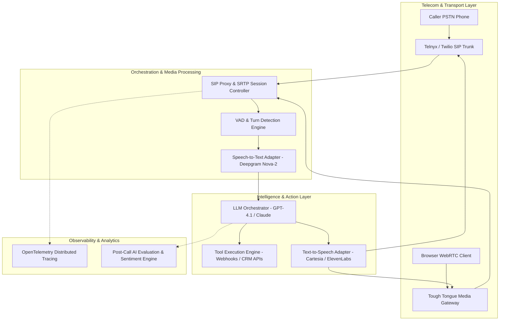

**Last Updated: August 11, 2026 | 8-minute read**

---

## The Thesis: All-in-One Beats Point Solutions

> **Direct Answer:** An all-in-one voice AI platform integrates telephony transport (SIP/PSTN), media gateway orchestration, real-time speech processing (STT/LLM/TTS), session state management, and post-call analytics into a unified control plane. Owning the entire stack eliminates multi-vendor integration fragility, guarantees end-to-end SLA latencies under 800ms, and provides full observability across every conversational turn.

The voice AI market in 2026 is fragmented:

- **STT providers** (Deepgram, AssemblyAI) — Just transcription
- **LLM providers** (OpenAI, Anthropic) — Just the brain
- **TTS providers** (ElevenLabs, Cartesia) — Just the voice
- **Telephony providers** (Twilio, Telnyx) — Just the phone line
- **Analytics providers** (Gong, Chorus) — Just the analysis
- **Agent frameworks** (LiveKit, Vapi, Retell) — Infrastructure, BYO everything else

To build a production voice AI agent, you stitch together 5-8 vendors. Each with different APIs, billing, support, and SLAs.

---

## Tough Tongue AI End-to-End Platform Architecture

Below is the complete architectural blueprint powering Tough Tongue AI's all-in-one conversational platform:

---

## The Voice AI Engineering SILO Architecture Hub

Explore our deep-dive technical engineering guides across every component of the Tough Tongue AI Voice Infrastructure:

- **Telephony & SIP:** [Add a Phone Number to Your AI Voice Agent in 60 Seconds](/blog/add-phone-number-ai-voice-agent-60-seconds-guide-2026)
- **Agent Builder:** [Build a Voice AI Agent Without Code in 5 Minutes](/blog/build-voice-ai-agent-no-code-minutes-guide-2026)
- **Observability & Debugging:** [Voice AI Agent Observability: Debug Every Call in Production](/blog/voice-ai-agent-observability-debug-every-call-2026)
- **Cloud Autoscaling:** [Deploy and Scale Voice AI Agents on Cloud Infrastructure](/blog/deploy-scale-voice-ai-agents-cloud-production-2026)
- **Unified Models:** [Unified Model Interface for Voice AI Inference](/blog/unified-model-interface-voice-ai-inference-2026)
- **Healthcare Reference Architecture:** [HIPAA-Compliant Healthcare Voice AI Reference Architecture](/blog/healthcare-ai-voice-agents-patient-communication-case-study-2026)
- **Multimodal Visual AI:** [Bringing AI Avatars to Voice Agents: The Next Frontier](/blog/ai-avatars-voice-agents-next-frontier-2026)
- **Turn-Taking & Latency:** [Solving End-of-Turn Detection in Voice AI](/blog/solving-end-of-turn-detection-voice-ai-agent-2026)
- **Unit Economics:** [Towards Future-Aligned Pricing for Voice AI: Per-Minute vs. Per-Seat](/blog/voice-ai-pricing-future-aligned-per-minute-2026)

---

## The Origin: A Deceptively Simple Problem

As we scaled the mock interview platform, something became clear: the core technology — real-time voice conversation with an AI that listens, understands, responds naturally, and evaluates performance — was not specific to interviews.

**Sales training.** Sales reps needed to practice cold calls, objection handling, and discovery calls. Same technology, different persona.

**AI calling.** Companies needed to make thousands of outbound calls — lead qualification, appointment setting, follow-ups. Same technology, different deployment (phone instead of browser).

**Customer support.** Businesses needed to answer inbound calls 24/7. Same technology, different conversation flow.

**Meeting assistance.** Teams needed AI that could join meetings, take notes, and provide coaching. Same technology, different context.

The insight: **voice AI is not a feature. It is an infrastructure layer.** Every business will have AI agents that talk to customers, employees, and partners. The question is not if, but how.

---

## The Thesis: All-in-One Beats Point Solutions

The voice AI market in 2026 is fragmented:

- **STT providers** (Deepgram, AssemblyAI) — Just transcription
- **LLM providers** (OpenAI, Anthropic) — Just the brain
- **TTS providers** (ElevenLabs, Cartesia) — Just the voice
- **Telephony providers** (Twilio, Telnyx) — Just the phone line
- **Analytics providers** (Gong, Chorus) — Just the analysis
- **Agent frameworks** (LiveKit, Vapi, Retell) — Infrastructure, BYO everything else

To build a production voice AI agent, you stitch together 5-8 vendors. Each with different APIs, billing, support, and SLAs. When something breaks on a call, you play whack-a-mole across vendors to find the root cause.

**Our thesis: the winning platform is the one that owns the full stack.**

Not because we build everything from scratch — we use the best STT, LLM, and TTS models available. But because we own the integration, optimization, and operational layer that makes them work together seamlessly.

**What does the Tough Tongue AI platform include?**

| Capability                                  | Included |
| ------------------------------------------- | -------- |
| AI Agent Builder (no-code)                  | ✅       |
| Voice selection and configuration           | ✅       |
| Phone number provisioning (SIP)             | ✅       |
| Inbound and outbound calling                | ✅       |
| CRM integration (Salesforce, HubSpot, Zoho) | ✅       |
| Calendar integration                        | ✅       |
| AI evaluation and scoring                   | ✅       |
| Call recording and transcription            | ✅       |
| Session analytics and observability         | ✅       |
| Webhook and API access                      | ✅       |
| Meeting bot integration                     | ✅       |
| Multi-language support                      | ✅       |
| Hinglish (code-switching)                   | ✅       |
| Noise cancellation                          | ✅       |

One platform. One bill. One support team. Everything works together because it was designed to.

---

## What We Have Built

### For Sales Teams

- **AI Sales Calling** — Outbound lead qualification, appointment setting, follow-up calls
- **AI Sales Roleplay** — Train reps with realistic AI buyers who handle objections
- **Call Auditing** — AI evaluates 100% of calls against your playbook
- **Pipeline Analytics** — Track AI calling performance from dial to close

### For Support Teams

- **Inbound AI Agents** — Answer 100% of calls 24/7
- **Warm Transfer** — Seamless handoff to humans with full context
- **Multi-language Support** — Hindi, English, Hinglish, Tamil, Telugu, and more

### For Developers

- **Full API Access** — Every feature available via REST API
- **Webhook Integration** — Connect to any system
- **Custom Scenarios** — Programmatic agent configuration
- **Session Analytics API** — Build custom dashboards

### For Enterprises

- **Multi-tenant** — Separate workspaces per team/department
- **Role-based access** — Control who can create, edit, and deploy agents
- **Compliance** — GDPR, DPDP, HIPAA-ready infrastructure
- **Custom SIP trunks** — Bring your own phone numbers and carriers

---

## The Market We See

Voice AI is at an inflection point. Three trends are converging:

**1. Models are fast enough.** Sub-300ms time-to-first-token from frontier LLMs means conversational latency is no longer a dealbreaker. Two years ago, it was.

**2. Voice quality crossed the uncanny valley.** Modern TTS (Cartesia Sonic-2, ElevenLabs Turbo v3) produces voices that are indistinguishable from human speech in blind tests. Two years ago, they were not.

**3. Cost dropped below the human threshold.** A voice AI minute costs \$0.05-\$0.15. A human minute costs \$0.50-\$2.00. The economics now favor AI for volume calling. Two years ago, they did not.

The result: every business that makes or receives phone calls — which is every business — is evaluating voice AI. The market is moving from "should we try this?" to "which platform do we use?"

---

## Where We Are Headed

### Short-Term (Next 6 Months)

- **Avatar integration** — Visual AI agents for video-based interactions
- **Multi-agent orchestration** — Specialized agents handing off between each other
- **Advanced analytics** — Conversation intelligence across all calls
- **Self-hosted option** — Deploy on your own infrastructure for data sovereignty

### Medium-Term (6-18 Months)

- **Agentic actions** — AI agents that do not just talk, but act (send emails, update CRMs, trigger workflows autonomously)
- **Memory across sessions** — AI agents that remember previous conversations with the same caller
- **Real-time coaching** — AI whispering suggestions to human agents during live calls
- **Industry-specific models** — Fine-tuned models for healthcare, finance, real estate

### Long-Term (18+ Months)

- **Fully autonomous AI sales teams** — AI agents that run the entire sales funnel from first contact to close
- **Omnichannel orchestration** — Voice + text + email + video coordinated by one AI brain
- **Predictive calling** — AI determines the optimal time, channel, and message for each prospect

---

## Join Us

We are building the future of how businesses communicate. Whether you are a sales leader looking to scale outbound, a CTO evaluating voice AI infrastructure, or a developer building the next generation of AI agents — we would love to talk.

- **[Book a free 30-minute demo with Ajitesh](https://cal.com/ajitesh/30min)**
- **[Try Tough Tongue AI now](https://app.toughtongueai.com/)**
- **[Explore our blog for technical deep-dives](/blog)**

---

## Frequently Asked Questions (FAQ)

### What is Tough Tongue AI?

Tough Tongue AI is an all-in-one voice AI platform for building, deploying, and managing AI calling agents. It includes everything needed for production voice AI: agent builder, phone numbers, CRM integration, call recording, AI evaluation, and analytics. It started as an AI mock interview platform and evolved into a comprehensive voice AI infrastructure serving sales, support, and training use cases.

### How is Tough Tongue AI different from LiveKit, Vapi, or Retell?

LiveKit, Vapi, and Retell are infrastructure providers — they give you the building blocks (SDKs, APIs, media servers) and you build the application. Tough Tongue AI is a complete platform — it includes the infrastructure plus the application layer: no-code agent builder, phone numbers, CRM integration, evaluation, analytics, and more. If LiveKit is the engine, Tough Tongue AI is the car.

### What industries use Tough Tongue AI?

Primary industries: B2B SaaS sales, healthcare, real estate, education (edtech), financial services, insurance, and recruitment. Any business that makes or receives a high volume of phone calls can benefit from AI calling agents.

### Can I start with Tough Tongue AI without technical expertise?

Yes. The no-code scenario builder lets you create and deploy a voice AI agent in under 5 minutes without writing code. For advanced use cases, the full API and webhook system provides developer-level control. Most customers start no-code and graduate to API-driven configuration as their needs grow.

---

_Disclaimer: Forward-looking statements about product roadmap are subject to change. All capabilities described as available are production-ready as of July 2026._
