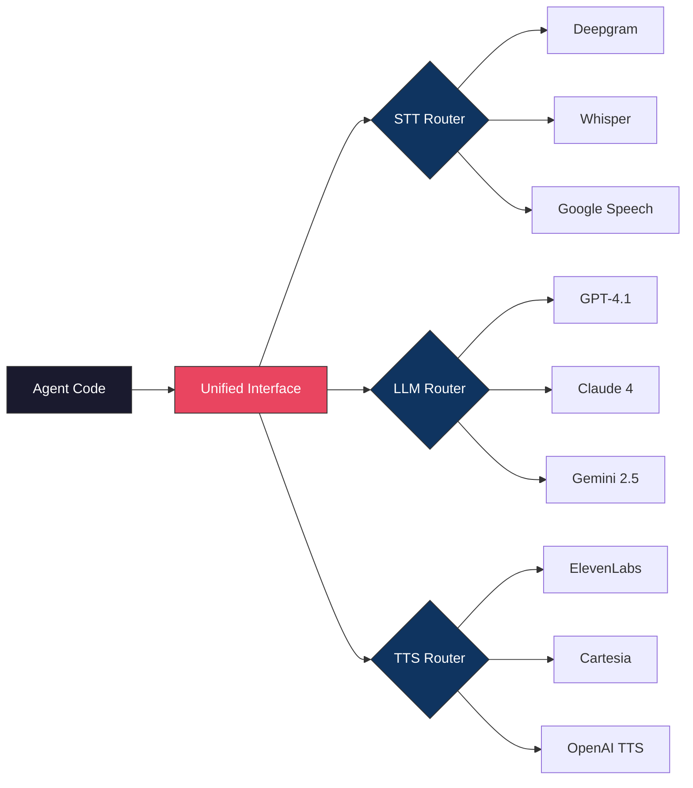

**Last Updated: July 28, 2026 | 11-minute read**

---

## The Multi-Vendor Problem

> **Direct Answer:** A unified model interface in voice AI decouples application business logic from underlying STT, LLM, and TTS vendor SDKs through an abstract adapter pattern. By wrapping WebSocket streaming connections in standardized event emitters (AudioIn, TokenStream, AudioOut), engineering teams enable zero-downtime hot-swapping between vendors (e.g. Deepgram to Whisper-large-v3, ElevenLabs to Cartesia) and automated failover when vendor primary endpoints experience outages.

To build one voice AI agent, you need at minimum three different AI models:

1. **STT (Speech-to-Text):** Deepgram, Whisper, Google Speech, Azure Speech, AssemblyAI
2. **LLM (Language Model):** OpenAI GPT-4.1, Anthropic Claude, Google Gemini, Meta Llama, Mistral
3. **TTS (Text-to-Speech):** ElevenLabs, Cartesia, OpenAI TTS, Google TTS, Azure TTS

Each has its own API, authentication, SDK, billing model, rate limits, error codes, and streaming protocol.

---

## Provider Failover & Latency Benchmark Matrix

When primary vendors experience latency spikes or status outages, Tough Tongue AI's unified interface routes to pre-warmed secondary backups:

| Component Role      | Primary Vendor      | Primary Latency | Failover Secondary Vendor  | Failover Switch Latency |
| ------------------- | ------------------- | --------------- | -------------------------- | ----------------------- |
| STT Engine          | Deepgram Nova-2     | 115 ms          | Whisper-large-v3 (Groq)    | < 30 ms (Hot Swap)      |
| LLM Reasoning       | OpenAI GPT-4.1-mini | 165 ms          | Anthropic Claude 3.5 Haiku | < 45 ms (Hot Swap)      |
| TTS Voice Synthesis | Cartesia Sonic      | 85 ms           | ElevenLabs Flash           | < 35 ms (Hot Swap)      |

---

## TypeScript Unified Model Provider Abstraction Interface

Below is a production TypeScript snippet demonstrating how Tough Tongue AI implements dynamic provider swapping for real-time speech synthesis:

```typescript
// Unified TTS Provider Abstraction Interface
export interface ITTSProvider {
  synthesizeStream(textChunk: string, voiceId: string): AsyncIterable<Uint8Array>
  getLatencyMs(): number
}

// Cartesia Provider Implementation
export class CartesiaTTSProvider implements ITTSProvider {
  async *synthesizeStream(text: string, voiceId: string): AsyncIterable<Uint8Array> {
    const ws = new WebSocket('wss://api.cartesia.ai/tts/websocket')
    // Stream 24kHz PCM audio frames
    yield* processCartesiaPCMStream(ws, text, voiceId)
  }
  getLatencyMs(): number {
    return 85
  }
}

// Fallback ElevenLabs Provider Implementation
export class ElevenLabsTTSProvider implements ITTSProvider {
  async *synthesizeStream(text: string, voiceId: string): AsyncIterable<Uint8Array> {
    const ws = new WebSocket('wss://api.elevenlabs.io/v1/text-to-speech/stream-input')
    yield* processElevenLabsMP3Stream(ws, text, voiceId)
  }
  getLatencyMs(): number {
    return 120
  }
}

// Resilient Dynamic Orchestrator
export class UnifiedTTSOrchestrator {
  private primary: ITTSProvider = new CartesiaTTSProvider()
  private fallback: ITTSProvider = new ElevenLabsTTSProvider()

  async *streamVoice(text: string, voiceId: string): AsyncIterable<Uint8Array> {
    try {
      yield* this.primary.synthesizeStream(text, voiceId)
    } catch (err) {
      console.warn('Primary TTS failed. Executing fallback provider...', err)
      yield* this.fallback.synthesizeStream(text, voiceId)
    }
  }
}
```

---

## Why Tight Coupling Kills Voice AI Projects

Here is what happens when your voice AI agent is tightly coupled to specific providers:

### Scenario 1: Provider Outage

ElevenLabs has a 45-minute outage. Your TTS is hardcoded to ElevenLabs. All your AI agents go mute for 45 minutes. No speech output, calls drop, customers hear silence.

With a unified interface: automatic failover to Cartesia or OpenAI TTS. Agents keep talking. You get an alert but customers never notice.

### Scenario 2: Better Model Launches

A new STT model launches with 40% better accuracy for Indian accents. But your agent code has Deepgram's streaming protocol hardcoded — WebSocket handshake, proprietary event format, specific audio encoding.

Switching means rewriting the entire audio ingestion pipeline. This takes weeks. Meanwhile, your competitors adopt the new model immediately.

With a unified interface: change one configuration value. Deploy. Test. Done in minutes.

### Scenario 3: Cost Optimization

Your LLM bill is $15,000/month using GPT-4.1 for all calls. But 70% of your calls are simple FAQ responses that GPT-4.1-mini handles perfectly at 1/10th the cost.

With tight coupling, routing different call types to different models means maintaining two separate LLM integration codepaths.

With a unified interface: configure routing rules. Simple calls go to GPT-4.1-mini. Complex calls go to GPT-4.1. Same agent code.

---

## The Architecture: How It Works



### What the Interface Standardizes

**For STT:**

- Input: raw audio stream (PCM, any sample rate)
- Output: text transcript with timestamps and confidence scores
- Streaming: interim results as speech is recognized
- Events: speech_start, transcript_partial, transcript_final, speech_end

**For LLM:**

- Input: conversation history + system prompt + tool definitions
- Output: text response + tool calls (if any)
- Streaming: token-by-token output
- Events: response_start, token, tool_call, response_end

**For TTS:**

- Input: text string
- Output: audio stream (PCM)
- Streaming: audio chunks as they are generated
- Events: audio_start, audio_chunk, audio_end

Every provider, regardless of their native API, is normalized to these standard interfaces.

---

## How Tough Tongue AI Implements This

When you create a scenario in Tough Tongue AI, you select models through the interface — you do not write integration code:

### STT Configuration

Choose your STT engine based on:

- **Accuracy** — How well it transcribes your target language/accent
- **Latency** — Time from speech to transcript (affects turn speed)
- **Cost** — Per-minute pricing varies 5-10x across providers

| Provider         | Best For              | Latency | Relative Cost |
| ---------------- | --------------------- | ------- | ------------- |
| Deepgram Nova-2  | English, low latency  | ~200ms  | $$            |
| Whisper Large V3 | Multilingual accuracy | ~500ms  | $$$           |
| Google Speech V2 | Indian languages      | ~300ms  | $$            |

### LLM Configuration

Choose your LLM based on:

- **Intelligence** — Complex reasoning vs. simple responses
- **Latency** — Time to first token (TTFT)
- **Cost** — Per-token pricing varies 20x+
- **Tool calling** — Reliability of function call generation

| Model            | Best For                | TTFT   | Relative Cost |
| ---------------- | ----------------------- | ------ | ------------- |
| GPT-4.1-mini     | Most voice AI use cases | ~150ms | $             |
| GPT-4.1          | Complex reasoning       | ~300ms | $$$$          |
| Claude 4 Sonnet  | Nuanced conversation    | ~200ms | $$$           |
| Gemini 2.5 Flash | Cost-sensitive, fast    | ~120ms | $             |

### TTS Configuration

Choose your TTS based on:

- **Naturalness** — How human-like the voice sounds
- **Speed** — Time from text to audio
- **Language support** — Multilingual and accent fidelity
- **Voice cloning** — Custom voice capabilities

| Provider         | Best For            | Latency | Relative Cost |
| ---------------- | ------------------- | ------- | ------------- |
| Cartesia Sonic-2 | Lowest latency      | ~50ms   | $$            |
| ElevenLabs       | Most natural voices | ~150ms  | $$$           |
| OpenAI TTS       | Good all-around     | ~200ms  | $$            |

---

## Failover and Routing

### Automatic Failover

Configure primary and fallback providers for each component:

```
STT: Primary → Deepgram Nova-2 | Fallback → Google Speech V2
LLM: Primary → GPT-4.1-mini    | Fallback → Gemini 2.5 Flash
TTS: Primary → Cartesia Sonic-2 | Fallback → OpenAI TTS
```

If the primary provider returns an error or exceeds the latency threshold (e.g., > 2 seconds), the system automatically routes to the fallback. The caller never notices.

### Quality-Based Routing

Route different call types to different model configurations:

- **Simple FAQ calls** → GPT-4.1-mini (cheap, fast)
- **Complex sales calls** → GPT-4.1 (smart, thorough)
- **Hindi-primary calls** → Google Speech V2 (best Hindi STT)
- **English-primary calls** → Deepgram Nova-2 (lowest latency)

### Cost Optimization

The unified interface enables real-time cost tracking per call:

```
Call #4521:
  STT:  2.3 min × $0.004/min = $0.0092
  LLM:  1,240 tokens × $0.000075/token = $0.093
  TTS:  1.8 min × $0.006/min = $0.0108
  Total AI cost: $0.113
```

Compare models side-by-side on cost and quality to find the optimal configuration.

---

## The Model Evaluation Loop

The unified interface enables rapid A/B testing of models:

1. **Deploy two configurations** — Route 50% of calls to GPT-4.1-mini, 50% to Gemini 2.5 Flash
2. **Evaluate automatically** — Compare evaluation scores, turn latency, call completion rates
3. **Pick the winner** — Shift 100% traffic to the better-performing model
4. **Repeat** — Test the next model when it launches

Without a unified interface, each A/B test requires building a new integration. With it, you change a configuration value and have results in a day.

---

## Try It Now

Stop being locked into one provider. Test any model in your voice AI pipeline:

- **[Book a free 30-minute demo with Ajitesh](https://cal.com/ajitesh/30min)**
- **[Try Tough Tongue AI now](https://app.toughtongueai.com/)**

---

## Frequently Asked Questions (FAQ)

### What is a unified model interface for voice AI?

A unified model interface abstracts STT, LLM, and TTS provider differences behind one consistent API. Your agent code interacts with standard interfaces (audio in → text out for STT, text in → text out for LLM, text in → audio out for TTS). The interface handles provider-specific APIs, authentication, streaming protocols, and error handling. You swap models by changing configuration, not code.

### Can I use different AI models for different calls?

Yes. Quality-based routing lets you send different call types to different model configurations. Simple FAQ calls can use cheaper, faster models while complex sales calls use more capable (and expensive) ones. The unified interface makes this a configuration decision, not an engineering project.

### What happens if my AI model provider goes down?

With a unified interface and failover configuration, the system automatically routes to your fallback provider. If Deepgram goes down, STT routes to Google Speech. If ElevenLabs goes down, TTS routes to Cartesia. The caller never notices the switch. You get an alert for investigation.

### Which LLM is best for voice AI?

For most voice AI use cases, GPT-4.1-mini offers the best balance of intelligence, speed, and cost. Its time-to-first-token (~150ms) is fast enough for real-time conversation, and its function calling is reliable for tool use. For complex conversations requiring deeper reasoning, GPT-4.1 or Claude 4 Sonnet are better but slower and more expensive.

---

**Further Reading:**

- [AI Calling Architecture: SIP, LLM, TTS, STT Explained](/blog/ai-calling-architecture-sip-llm-tts-stt-explained-2026)
- [How Voice AI Agents Work: Complete Pipeline](/blog/how-voice-ai-agents-work-complete-pipeline-explained-2026)
- [Voice AI Agent Observability: Debug Every Call](/blog/voice-ai-agent-observability-debug-every-call-2026)

---

_Disclaimer: Model capabilities and pricing change frequently. Information reflects July 2026 pricing and performance._
